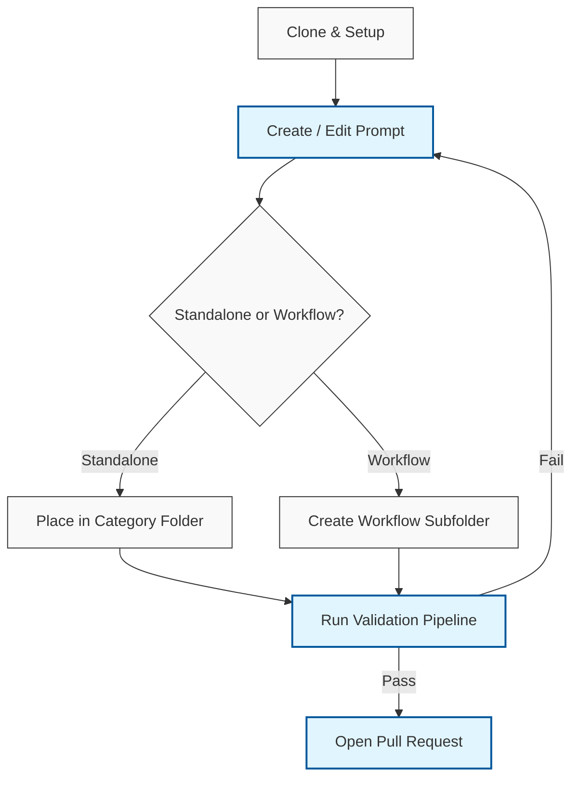

# Contributing to Proompts 🚀

Thank you for your interest in contributing to the Proompts repository! This guide will help you get started with adding new prompts, improving documentation, and submitting changes.

## What is this guide?

This document outlines the standard operating procedure for contributing to the Proompts library. It covers the end-to-end lifecycle of a contribution, from setting up your local environment to opening a Pull Request.

## Why do we have these rules?

Proompts treats "Prompts as Code". This means our prompts must be structured, testable, and documented just like traditional software. By following these guidelines, you help us:
- **Maintain High Quality**: Automated tests (`testData`) ensure prompts behave as expected.
- **Prevent Documentation Debt**: Automated scripts keep our docs and directories in sync.
- **Reduce Friction**: A standardized structure makes it easy for anyone to find, use, and modify prompts.

## How to Contribute

The contribution process follows a simple lifecycle: **Setup ➡️ Create ➡️ Validate ➡️ Submit**.

### The Contribution Lifecycle



---

### Step 1: Setup Your Environment

1.  **Fork and Clone**: Fork the repository and clone it to your local machine.
2.  **Install Dependencies**: The validation scripts require Python 3 and a few packages.
    ```bash
    python3 -m venv venv
    source venv/bin/activate
    pip install -r requirements.txt
    ```

### Step 2: Add or Edit a Prompt

All prompts must be written as `.prompt.yaml` files.

> [!NOTE]
> **Schema is Strict!**
> Your YAML must follow the exact structure defined in [`docs/template_prompt.prompt.yaml`](docs/template_prompt.prompt.yaml).

1.  **Create the File**:
    *   **Standalone Prompts**: Place directly in the appropriate category folder (e.g., `prompts/business/market_research.prompt.yaml`). Do *not* number the filename.
    *   **Workflow Prompts**: If your prompt is part of a chained workflow, create a dedicated subfolder named `<workflow_name>_workflow/` and number the files sequentially (e.g., `prompts/clinical/protocol/protocol_workflow/01_clinical_trial_protocol_creator.prompt.yaml`).
2.  **Fill Required Fields**:
    *   `name`: A short, descriptive title.
    *   `description`: What does this prompt do?
    *   `model` & `modelParameters`: The target LLM and settings (like temperature).
    *   `messages`: The actual prompt content (use `{{variable}}` for inputs).
3.  **Add Test Data (Crucial!)**:
    *   Provide `testData` array with sample inputs and `expected` outputs. This allows our simulation engine to test the prompt without making API calls.
4.  **Add Evaluators (Optional but recommended)**:
    *   Define regex or string matching rules to automatically grade the LLM's output.

### Step 3: Run the Validation Pipeline

Before committing, you **must** run the test suite. This ensures your YAML is valid, tests pass, and documentation is updated.

> [!WARNING]
> Do not skip this step! The CI pipeline will fail your PR if these checks do not pass locally.

Run the master script from the repository root:

```bash
python3 tools/scripts/test_all.py
```

**What this script does:**
*   `cleanup_mac_files`: Removes hidden macOS files (`._*`) that break parsing.
*   `check_prompts`: Validates naming conventions and directory structures.
*   `validate_prompt_schema`: Ensures your YAML matches the Pydantic schema (checks for missing fields or empty `testData`).
*   `generate_docs` & `update_docs_index`: Automatically regenerates the Markdown documentation site based on your changes!
*   `yamllint`: Checks for formatting issues.

If `test_all.py` fails on documentation checks, you can force a regeneration by running:
```bash
python3 tools/scripts/generate_docs.py
python3 tools/scripts/update_docs_index.py
```

### Step 4: Submit Your Pull Request

1.  **Commit**: Use clear, descriptive commit messages (e.g., `feat: Add new risk assessment prompt`).
2.  **Push**: Push to your fork.
3.  **PR**: Open a Pull Request against the `main` branch of the upstream repository.
    *   Include a brief description of what you added or fixed.
    *   Confirm that you ran `python3 tools/scripts/test_all.py` locally.

## Style Guide 🎨

- **YAML**: Use 2 spaces for indentation. Wrap long text blocks using the block scalar `|-` operator.
- **Variables**: Always use double curly braces: `{{variable_name}}`. Do not add spaces inside the braces.
- **Descriptions**: Keep descriptions concise and action-oriented.
- **Test Data**: Make your test cases realistic. Don't use "foo" and "bar" if the prompt expects a clinical protocol summary.

## Need Help?

If you run into issues, check the [`docs/BEST_PRACTICES.md`](docs/BEST_PRACTICES.md) or explore the [`tools/scripts/README.md`](tools/scripts/README.md) for more detailed information on our tooling. You can also open an issue to ask questions.
