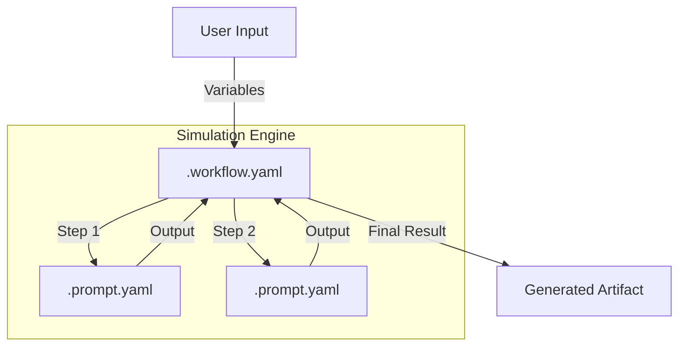

# Proompts

[](https://github.com/fderuiter/proompts/actions/workflows/deploy-pages.yml)
[](https://github.com/fderuiter/proompts/actions/workflows/yaml-validation.yml)
[](https://github.com/fderuiter/proompts/actions/workflows/repo-checks.yml)

A curated set of prompts in YAML for AI-assisted product development, regulatory workflows, and general operations. Prompts are organized by topic: ranging from code reviews to market research. You can mix and match them in your own agentic workflows!

## 🗺️ Directory Map

This repository is organized to separate content (prompts), logic (workflows), and tooling.

```
.
├── docs/                # Documentation site & guides
├── prompts/             # The Core Library (YAML source)
│   ├── business/        # Finance, HR, Market Research
│   ├── clinical/        # Trial Ops, Data Mgmt, Protocols
│   ├── communication/   # Writing, Speaking, Negotiation
│   ├── management/      # Leadership, Strategy, Project Mgmt
│   ├── meta/            # Prompt Engineering & Agents
│   ├── regulatory/      # Compliance, FDA/EMA Submissions
│   ├── scientific/      # Lab, BioSafety, Statistics
│   └── technical/       # Software Eng, DevOps, Security
├── scripts/             # Convenience Wrappers (e.g., validate_prompts.sh)
├── tools/               # Developer Utilities
│   └── scripts/         # Validation, Simulation, & Maintenance Scripts
└── workflows/           # Orchestration Logic (YAML)
```

## 🏗️ System Architecture

We treat **Prompts as Code**. This repository uses a Simulation Engine to chain prompts into complex workflows.



- **Prompts**: Single-task instructions (YAML).
- **Workflows**: Chains of prompts with state management.
- **Engine**: `run_workflow.py` executes these locally for testing and simulation.

See [System Architecture](docs/system_architecture.md) for a deep dive.

## 🚀 Quick Start

### 1. Setup Environment
To run validation scripts and tools locally, you need Python 3.

```bash
# Create and activate virtual environment
python3 -m venv venv
source venv/bin/activate

# Install dependencies
pip install -r requirements.txt
```

### 2. Run a Workflow (Simulation)
Try running the **Agentic Coding** workflow to see the engine in action.

```bash
python3 tools/scripts/run_workflow.py workflows/technical/agentic_coding.workflow.yaml -i product_concept="A new time-tracking app"
```

### 3. Search Prompts
Find prompts related to a specific topic.

```bash
python3 tools/scripts/search_prompts.py "code review"
```

### 4. Validate Your Changes
Run the full test suite to ensure your prompts are valid.

```bash
python3 tools/scripts/test_all.py
```

## 📝 Prompt Schema

Prompts are stored as `.prompt.yaml` files following a strict schema:

```yaml
name: "Code Reviewer"
description: "Reviews code for best practices."
model: "gpt-4o-mini"
messages:
  - role: "user"
    content: "Review this code: {{code_snippet}}"
testData:
  - code_snippet: "print('hello')"
    expected: "No issues found."
```

See [`docs/template_prompt.prompt.yaml`](docs/template_prompt.prompt.yaml) for a full example.

## 🤝 Contributing

We welcome contributions! Please see [CONTRIBUTING.md](CONTRIBUTING.md) for detailed instructions.

**The Golden Rule:** Always run `python3 tools/scripts/test_all.py` before committing.

## 📄 License

This project is licensed under the [Proompts Personal Use License](LICENSE.md).
Individuals may freely use, modify, and distribute the prompts for personal,
non-commercial purposes. Commercial entities must obtain written permission
from Frederick de Ruiter before using the material.
