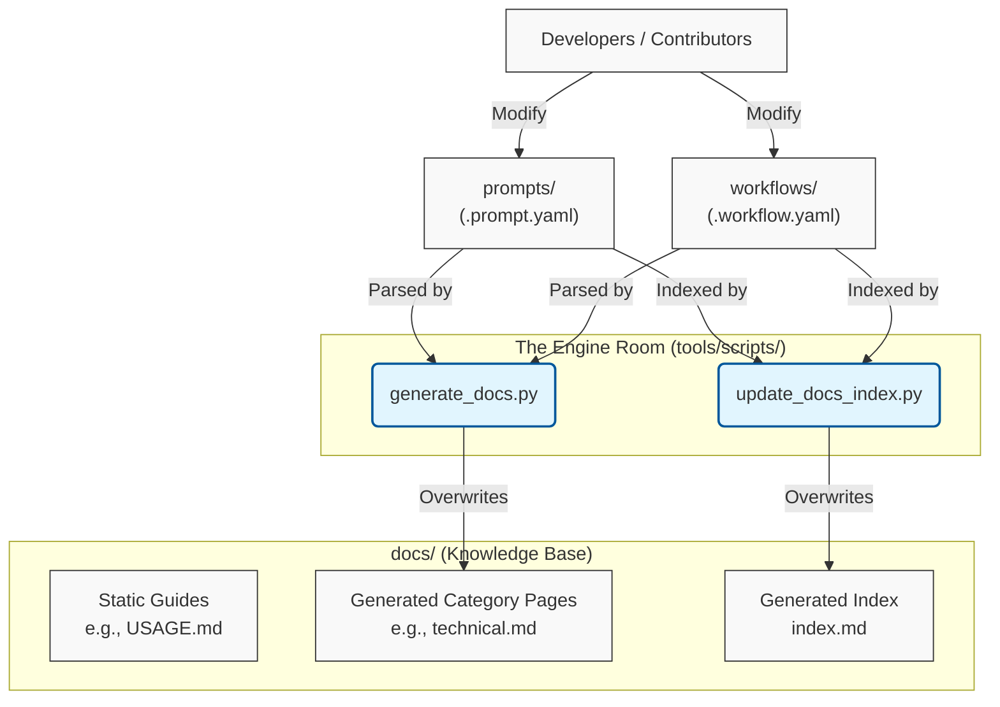

# Knowledge Base & Documentation Site 📚

> [!NOTE]
> **TL;DR - Quickstart for Developers**
> Before committing changes to prompts or workflows, you must regenerate the automated documentation by running the master validation script from the repository root:
> ```bash
> python3 tools/scripts/test_all.py
> ```

## What is this?

The `docs/` directory is the central Knowledge Base and User Interface for the Proompts repository. It contains the Markdown files that build the static Jekyll documentation site, including essential guides, usage instructions, and a complete catalog of all prompts.

## Why does it exist?

As the repository scales, discovering and understanding prompts via raw YAML files becomes difficult. The `docs/` directory exists to provide a human-readable, easily navigable interface for other developers and users, optimizing their "Time to Understanding."

It effectively serves as the "Front-End" for the repository's "Prompts as Code" architecture.

## How does it work?

### The Dual Nature of `docs/`

The contents of this directory fall into two distinct categories. **It is critical to understand this distinction before editing files.**

1. **Static Guides (Safe to Edit manually)**
   These are handwritten markdown files containing overarching rules, tutorials, and architecture definitions.
   *Examples:* `USAGE.md`, `BEST_PRACTICES.md`, `workflow_guide.md`, `system_architecture.md`, and this `README.md`.

2. **Generated Artifacts (Do NOT edit manually)**
   These files are automatically generated by the scripts in `tools/scripts/`. Any manual changes made to them will be overwritten during the next CI/CD build or local script execution.
   *Examples:* `index.md`, `table-of-contents.md`, and category pages like `clinical.md` or `technical.md`.

### The Documentation Pipeline

When you add or update a `.prompt.yaml` or `.workflow.yaml` file, the documentation pipeline extracts metadata (like `name`, `description`, `inputs`, and `steps`) and generates the corresponding Markdown documentation.



### Generating the Documentation Locally

If you are modifying the Python generation scripts or need to force a documentation update without running the full test suite, you can run the scripts individually:

```bash
# Generates the category pages and workflow diagrams
python3 tools/scripts/generate_docs.py

# Updates the main index.md and table-of-contents.md
python3 tools/scripts/update_docs_index.py
```
