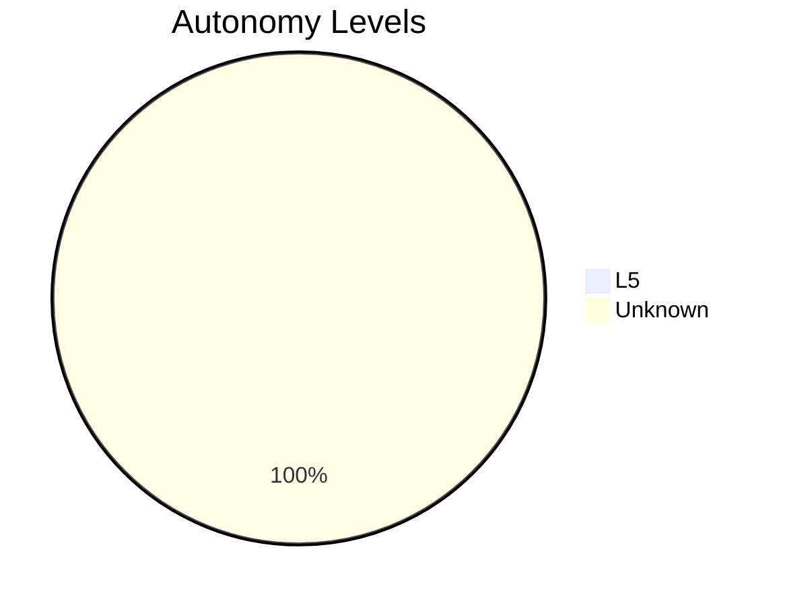
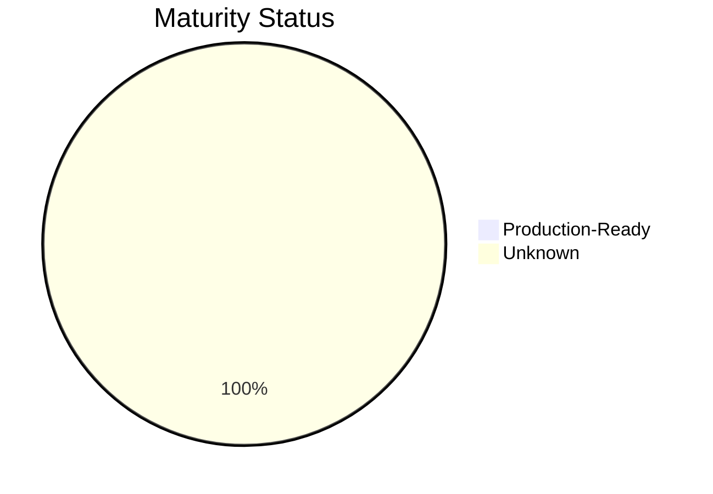

# 📊 Maturity Dashboard

This dashboard provides an aggregate view of prompt and skill compliance across the library.

## Compliance Summary

- **Total Prompts:** 1173
- **L5-Compliant Prompts:** 1 (0.1%)

## Autonomy Levels

| Level | Count |
|-------|-------|
| L5 | 1 |
| Unknown | 1172 |

## Maturity Status

| Status | Count |
|--------|-------|
| Production-Ready | 1 |
| Unknown | 1172 |

## Visualizations

### Autonomy Distribution

### Maturity Distribution

