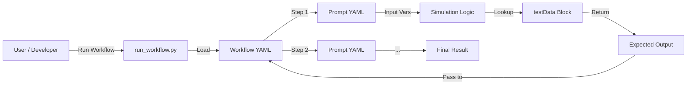
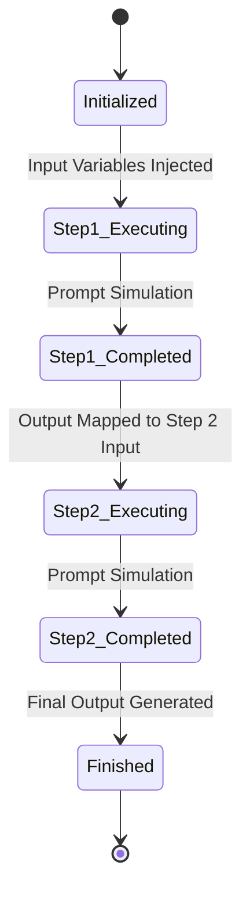
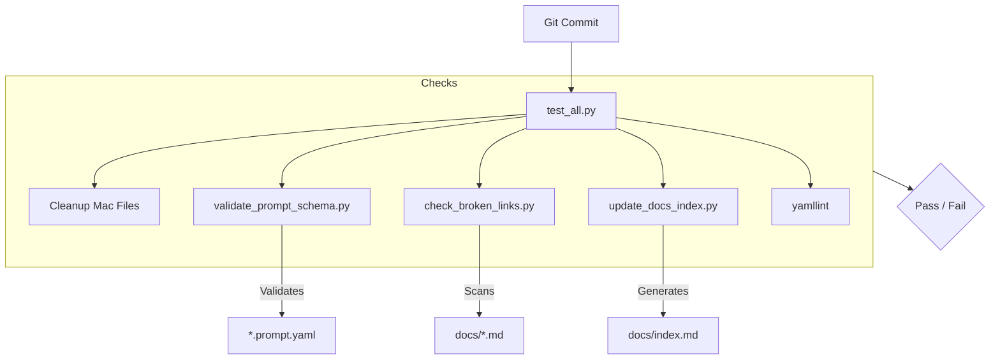

# System Architecture & Design

This document details the technical design of the **Proompts** repository. It explains how prompts are structured, how workflows are simulated, and how the validation pipeline ensures quality.

## 1. Philosophy: Prompts as Code

The core philosophy of this repository is that **Prompts are Software**. They should be:
- **Versioned**: Stored in Git.
- **Structured**: Defined in YAML with a strict schema, not just free text.
- **Tested**: Validated with test cases and evaluators.
- **Modular**: Composable into workflows.

This approach allows for rigorous engineering practices (Code Review, CI/CD, Testing) to be applied to Prompt Engineering.

## 2. The Prompt Engine (Simulation Mode)

Currently, the repository acts as a **Library** and a **Simulation Engine**. The execution script (`run_workflow.py`) does **not** make live API calls to LLM providers (like OpenAI or Anthropic) by default. Instead, it **simulates** execution using defined `testData`.

### Simulation Data Flow



This design allows developers to:
1.  **Test Logic Rapidly**: Verify variable substitution and workflow chaining without latency or cost.
2.  **Ensure Determinism**: Tests always pass if the logic is correct, regardless of model stochasticity.
3.  **Work Offline**: No internet connection required for development.

To run this in production, you would swap the `simulate_prompt_execution` function in `run_workflow.py` with a real API client (e.g., `openai.ChatCompletion.create`).

## 3. Workflow Engine Architecture

Workflows orchestrate multiple prompts. They manage **State** and **Dependencies**.

### Workflow State Machine



- **Global Inputs**: Defined in `workflow.yaml` under `inputs`.
- **Step Inputs**: Mapped using Jinja2 syntax (e.g., `{{steps.step_id.output}}`).
- **Context**: The `workflow_state` dictionary grows as steps complete.

## 4. Validation Pipeline (`test_all.py`)

Every commit is verified by a strict validation pipeline.



### Key Scripts

| Script | Purpose |
| :--- | :--- |
| `validate_prompt_schema.py` | Enforces the Pydantic schema (required fields, valid YAML). |
| `check_prompts.py` | Enforces naming conventions and file locations. |
| `update_docs_index.py` | Regenerates the documentation index and table of contents. |
| `generate_docs.py` | Builds the static documentation site structure. |

## 5. Directory Map

A high-level view of the repository structure:

```text
.
├── docs/                   # Documentation Site (Jekyll)
│   ├── workflows/          # Generated workflow docs
│   └── *.md                # Category pages and guides
├── prompts/                # The Prompt Library
│   ├── business/           # Domain: Business
│   ├── clinical/           # Domain: Clinical
│   ├── technical/          # Domain: Technical
│   └── ...                 # Other domains
├── tools/                  # Developer Tools
│   ├── scripts/            # Python maintenance scripts
│   └── prompt_tools/       # Meta-prompts for repo maintenance
└── workflows/              # Workflow Definitions
    ├── clinical/           # Clinical workflows
    └── ...                 # Other workflow domains
```
