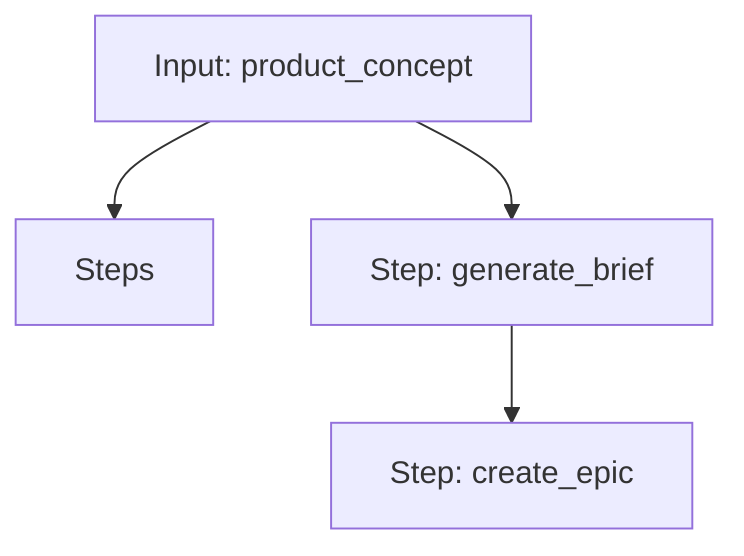

# Workflow Guide 🔄

Workflows are the powerhouse of this repository. They allow you to chain multiple prompts together into a coherent, multi-step process, passing data from one step to the next automatically.

> [!NOTE]
> Workflows are ideal for complex tasks that require multiple reasoning steps, such as "Analyze a problem -> Propose a solution -> Critique the solution".

---

## 1. Introduction

A **Workflow** is defined in a `.workflow.yaml` file. It orchestrates a sequence of prompts, managing inputs and outputs between them.

**Why use Workflows?**
- **Modularity:** Break down complex tasks into smaller, reusable prompts.
- **Automation:** Run end-to-end processes without manual copy-pasting.
- **Reproducibility:** Define standard operating procedures (SOPs) as code.

---

## 2. Anatomy of a Workflow

A workflow file consists of metadata, global inputs, and a list of steps.

### Example Structure

```yaml
name: "Idea to Epic Workflow"
description: "Takes a product idea and generates a full project brief and epic."
inputs:
  - name: "product_concept"
    description: "A short description of the product idea."
steps:
  - step_id: "generate_brief"
    prompt_file: "prompts/technical/software_engineering/lifecycle/01_product_brief.prompt.yaml"
    map_inputs:
      product_concept: "{{inputs.product_concept}}"

  - step_id: "create_epic"
    prompt_file: "prompts/technical/software_engineering/lifecycle/02_project_brief_epic.prompt.yaml"
    map_inputs:
      product_brief: "{{steps.generate_brief.output}}"
```

### Key Components

| Field | Description |
| :--- | :--- |
| `name` | Human-readable name of the workflow. |
| `description` | Concise summary of what the workflow achieves. |
| `inputs` | Global inputs required to start the workflow. Accessible via `{{inputs.name}}`. |
| `steps` | Ordered list of prompt execution steps. |

### Step Configuration

Each step in the `steps` list requires:

- **`step_id`**: A unique identifier (e.g., `step_1`). Used to reference this step's output later.
- **`prompt_file`**: Path to the `.prompt.yaml` file, relative to the repository root.
- **`map_inputs`**: A dictionary mapping the prompt's input variables to data sources.
  - **`{{inputs.var_name}}`**: Pulls from global workflow inputs.
  - **`{{steps.step_id.output}}`**: Pulls from a previous step's output.

---

## 3. Tutorial: Create Your First Workflow

In this tutorial, we will create a simple **"Joke Generator"** workflow. It will consist of two steps:
1.  **Topic Generator:** Asks for a random topic.
2.  **Joke Writer:** Writes a joke about that topic.

### Step 1: Create the Directory Structure

Create a new directory for your workflow prompts:

```bash
mkdir -p prompts/communication/entertainment/joke_workflow
```

### Step 2: Create the Prompt Files

Create `prompts/communication/entertainment/joke_workflow/01_topic_generator.prompt.yaml`:

```yaml
name: Topic Generator
description: Generates a random topic for a joke.
model: gpt-4o-mini
messages:
  - role: system
    content: "You are a creative assistant."
  - role: user
    content: "Give me a random topic for a joke. Output ONLY the topic name."
testData:
  - expected: "Chickens"
```

Create `prompts/communication/entertainment/joke_workflow/02_joke_writer.prompt.yaml`:

```yaml
name: Joke Writer
description: Writes a joke about a given topic.
model: gpt-4o-mini
messages:
  - role: system
    content: "You are a professional comedian."
  - role: user
    content: "Write a short joke about {{topic}}."
testData:
  - topic: "Chickens"
    expected: "Why did the chicken cross the road? To get to the other side!"
```

### Step 3: Create the Workflow File

Create `workflows/communication/joke_generator.workflow.yaml`:

```yaml
name: Joke Generator Workflow
description: A simple two-step workflow to generate a topic and write a joke.
inputs: []
steps:
  - step_id: get_topic
    prompt_file: prompts/communication/entertainment/joke_workflow/01_topic_generator.prompt.yaml
    map_inputs: {}

  - step_id: write_joke
    prompt_file: prompts/communication/entertainment/joke_workflow/02_joke_writer.prompt.yaml
    map_inputs:
      topic: "{{steps.get_topic.output}}"
```

### Step 4: Run the Simulation

Test your workflow using the simulation engine (no API keys required):

```bash
python3 tools/scripts/run_workflow.py workflows/communication/joke_generator.workflow.yaml
```

You should see the output flow from the first step (Topic) to the second step (Joke).

---

## 4. Visualizing Workflows

Complex workflows can be hard to visualize in YAML. We use [Mermaid.js](https://mermaid.js.org/) to create flowcharts.

Every workflow in this repository has an automatically generated diagram in its documentation page.

**Example Diagram:**



> [!TIP]
> You can view these diagrams in the [Workflows List](workflows.md) by clicking on any workflow.

---

## 5. Running Workflows

We provide a Python script to execute workflows locally.

**Prerequisites:**
- Python 3.x
- Dependencies installed (`pip install -r requirements.txt`)
- An LLM provider API key (e.g., `OPENAI_API_KEY`) set in your environment.

**Command:**

```bash
python3 tools/scripts/run_workflow.py path/to/workflow.workflow.yaml [options]
```

**Options:**
- `-i key=value`: Provide global inputs.
- `-v`: Verbose mode (shows full prompts and responses).
- `--dry-run`: Simulate execution without calling the LLM.

**Example:**

```bash
# Run the 'Idea to Epic' workflow
python3 tools/scripts/run_workflow.py workflows/technical/agentic_coding.workflow.yaml \
  -i product_concept="A specialized AI for writing documentation"
```

---

## 6. Troubleshooting 🔧

Common issues when building workflows:

### "Step ID mismatch"
**Error:** `KeyError: 'step_name'`
**Cause:** You referenced `{{steps.step_name.output}}` but defined the step as `step_id: my_step`.
**Fix:** Ensure the `step_id` matches exactly what you reference in `map_inputs`.

### "Input missing"
**Error:** `ValueError: Missing input 'topic'`
**Cause:** The prompt expects a variable `{{topic}}` but you didn't provide it in `map_inputs`.
**Fix:** Check the `messages` section of your prompt file to see which variables are required, then map them in the workflow file.

### "YAML Syntax Error"
**Cause:** Incorrect indentation or invalid YAML structure.
**Fix:** Use a YAML linter or `python3 tools/scripts/validate_prompt_schema.py` to check your files.

---

## 7. Best Practices

1.  **Atomic Prompts:** Keep individual prompts focused on a single task. This makes them reusable in different workflows.
2.  **Clear Naming:** Use descriptive `step_id`s (e.g., `analyze_sentiment` instead of `step1`).
3.  **Input Validation:** Ensure your prompts handle missing or malformed inputs gracefully.
4.  **Documentation:** Always add a `description` to your workflow and inputs.
5.  **Test Data:** Include `testData` in your prompt files so they can be tested individually.

---

[Browse All Workflows](workflows.md)
