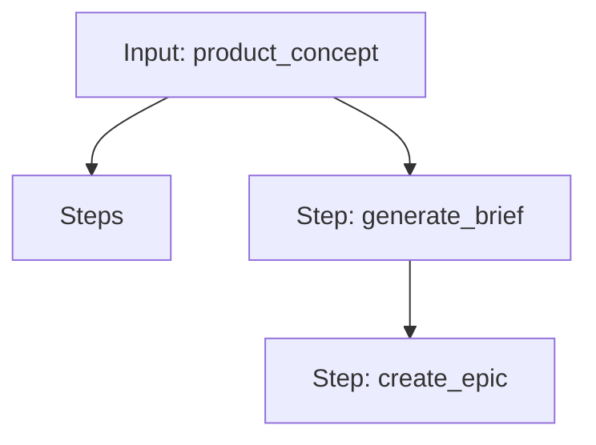

# Workflow Guide 🔄

Workflows are the powerhouse of this repository. They allow you to chain multiple prompts together into a coherent, multi-step process, passing data from one step to the next automatically.

**TL;DR - Run a workflow simulation:**
```bash
promptops workflow workflows/technical/software_engineering/paw_workflow.workflow.yaml -i product_concept="A new app idea"
```

> [!NOTE]
> Workflows are ideal for complex tasks that require multiple reasoning steps, such as "Analyze a problem -> Propose a solution -> Critique the solution".

---

## 1. Introduction

A **Workflow** is defined in a `.workflow.yaml` file. It orchestrates a sequence of prompts, managing inputs and outputs between them.

**Why use Workflows?**
- **Modularity:** Break down complex tasks into smaller, reusable prompts.
- **Automation:** Run end-to-end processes without manual copy-pasting.
- **Reproducibility:** Define standard operating procedures (SOPs) as code.

---

## 2. Anatomy of a Workflow

A workflow file consists of metadata, global inputs, and a list of steps.

### Example Structure

```yaml
name: "Idea to Epic Workflow"
description: "Takes a product idea and generates a full project brief and epic."
inputs:
  - name: "product_concept"
    description: "A short description of the product idea."
steps:
  - step_id: "generate_brief"
    prompt_file: "prompts/technical/software_engineering/lifecycle/01_product_brief.prompt.yaml"
    map_inputs:
      product_concept: "{{inputs.product_concept}}"

  - step_id: "create_epic"
    prompt_file: "prompts/technical/software_engineering/lifecycle/02_project_brief_epic.prompt.yaml"
    map_inputs:
      product_brief: "{{steps.generate_brief.output}}"
testData:
  - inputs:
      product_concept: "A new AI tool"
```

### Key Components

| Field | Description |
| :--- | :--- |
| `name` | Human-readable name of the workflow. |
| `description` | Concise summary of what the workflow achieves. |
| `inputs` | Global inputs required to start the workflow. Accessible via `{{inputs.name}}`. |
| `steps` | Ordered list of prompt execution steps. |

### Step Configuration

Each step in the `steps` list requires:

- **`step_id`**: A unique identifier (e.g., `step_1`). Used to reference this step's output later.
- **`prompt_file`**: Path to the `.prompt.yaml` file, relative to the repository root.
- **`map_inputs`**: A dictionary mapping the prompt's input variables to data sources.
  - **`{{inputs.var_name}}`**: Pulls from global workflow inputs.
  - **`{{steps.step_id.output}}`**: Pulls from a previous step's output.

---

## 3. Tutorial: Create Your First Workflow

In this tutorial, we will create a simple **"Joke Generator"** workflow. It will consist of two steps:
1.  **Topic Generator:** Asks for a random topic.
2.  **Joke Writer:** Writes a joke about that topic.

### Step 1: Create the Directory Structure

Create a new directory for your workflow prompts:

```bash
mkdir -p prompts/communication/entertainment/joke_workflow
```

### Step 2: Create the Prompt Files

Create `prompts/communication/entertainment/joke_workflow/01_topic_generator.prompt.yaml`:

```yaml
name: Topic Generator
description: Generates a random topic for a joke.
model: gpt-4o-mini
messages:
  - role: system
    content: "You are a creative assistant."
  - role: user
    content: "Give me a random topic for a joke. Output ONLY the topic name."
testData:
  - expected: "Chickens"
```

Create `prompts/communication/entertainment/joke_workflow/02_joke_writer.prompt.yaml`:

```yaml
name: Joke Writer
description: Writes a joke about a given topic.
model: gpt-4o-mini
messages:
  - role: system
    content: "You are a professional comedian."
  - role: user
    content: "Write a short joke about {{topic}}."
testData:
  - topic: "Chickens"
    expected: "Why did the chicken cross the road? To get to the other side!"
```

### Step 3: Create the Workflow File

Create `workflows/communication/joke_generator.workflow.yaml`:

```yaml
name: Joke Generator Workflow
description: A simple two-step workflow to generate a topic and write a joke.
inputs: []
steps:
  - step_id: get_topic
    prompt_file: prompts/communication/entertainment/joke_workflow/01_topic_generator.prompt.yaml
    map_inputs: {}

  - step_id: write_joke
    prompt_file: prompts/communication/entertainment/joke_workflow/02_joke_writer.prompt.yaml
    map_inputs:
      topic: "{{steps.get_topic.output}}"
testData:
  - inputs: {}
```

### Step 4: Run the Simulation

Test your workflow using the simulation engine (no API keys required):

```bash
promptops workflow workflows/communication/joke_generator.workflow.yaml
```

You should see the output flow from the first step (Topic) to the second step (Joke).

---

## 4. Visualizing Workflows

Complex workflows can be hard to visualize in YAML. We use [Mermaid.js](https://mermaid.js.org/) to create flowcharts.

Every workflow in this repository has an automatically generated diagram in its documentation page.

**Example Diagram:**


```mermaid
graph TD
    Input_concept[Input: product_concept] --> Steps
    generate_brief[Step: generate_brief]
    Input_concept --> generate_brief
    create_epic[Step: create_epic]
    generate_brief --> create_epic
```

> [!TIP]
> You can view these diagrams in the [Workflows List](../workflows/README.md) by clicking on any workflow.

---

## 5. Simulating Workflows

We provide a Python script to simulate workflow execution locally without making actual LLM API calls.

**Prerequisites:**
- Python 3.x
- Dependencies installed (`pip install -r requirements.txt`)

**Command:**

```bash
promptops workflow path/to/workflow.workflow.yaml [options]
```

**Options:**
- `-i key=value`: Provide global inputs.
- `-v`: Verbose mode (shows full prompts and responses).
- `-f`, `--inputs-file`: Path to a JSON or YAML file containing workflow inputs (Recommended for security)

**What it does:** It loads a `.workflow.yaml` file, parses the step execution order, resolves inter-step variable mappings, and deterministically simulates the output of each prompt using its defined `testData`.

**Why use it:** It allows developers to quickly verify the logic, input mappings, and output extraction of complex prompt chains without incurring API costs or dealing with network latency.

**Example:**

```bash
# Simulate the 'Idea to Epic' workflow
promptops workflow workflows/technical/agentic_coding.workflow.yaml \
  -i product_concept="A specialized AI for writing documentation"
```

> [!NOTE]
> To successfully simulate a workflow step, the corresponding prompt file must contain a `testData` array that matches the inputs passed to it during the simulation.

---

## 6. Troubleshooting 🔧

Common issues when building workflows:

### "Step ID mismatch"
**Error:** `KeyError: 'step_name'`
**Cause:** You referenced `{{steps.step_name.output}}` but defined the step as `step_id: my_step`.
**Fix:** Ensure the `step_id` matches exactly what you reference in `map_inputs`.

### "Input missing"
**Error:** `ValueError: Missing input 'topic'`
**Cause:** The prompt expects a variable `{{topic}}` but you didn't provide it in `map_inputs`.
**Fix:** Check the `messages` section of your prompt file to see which variables are required, then map them in the workflow file.

### "YAML Syntax Error"
**Cause:** Incorrect indentation or invalid YAML structure.
**Fix:** Use a YAML linter or `python3 tools/tools/scripts/validate_prompt_schema.py` to check your files.

---

## 7. Best Practices

1.  **Atomic Prompts:** Keep individual prompts focused on a single task. This makes them reusable in different workflows.
2.  **Clear Naming:** Use descriptive `step_id`s (e.g., `analyze_sentiment` instead of `step1`).
3.  **Input Validation:** Ensure your prompts handle missing or malformed inputs gracefully.
4.  **Documentation:** Always add a `description` to your workflow and inputs.
5.  **Test Data:** Include `testData` in your prompt files so they can be tested individually.

---

[Browse All Workflows](../workflows/README.md)

## 8. Advanced Features

### Checkpointing and State Recovery

Workflows automatically checkpoint their state after each step. If a long-running workflow fails or is interrupted, you can resume it from the last successful step. Checkpoints are stored in the `.checkpoints/` directory based on the unique run ID.

**Example: Checkpointing in Action**

```yaml
name: Checkpoint Demo Workflow
description: Demonstrates state recovery.
inputs:
  - name: data
steps:
  - step_id: process_data
    prompt_file: prompts/technical/software_engineering/lifecycle/To-Do_List_Template
    map_inputs:
      requirements: "{{inputs.data}}"
testData:
  - inputs:
      data: "test"
```

> [!NOTE]
> The engine handles checkpointing transparently. No extra configuration is needed!

### Chaos Mode Testing

Chaos mode allows you to simulate network latency and API errors (`429 Too Many Requests`, `500 Internal Server Error`, etc.) during testing. This is crucial for verifying that your workflow can handle rate limits and transient failures.

**Example: Simulating Errors**

```yaml
name: Resilient Prompt
description: A prompt with chaos mode test cases.
model: gpt-4o-mini
messages:
  - role: system
    content: "You are a robust system."
  - role: user
    content: "Process {{input}}"
testData:
  - input: "test1"
    simulated_latency: 0.5
    expected: "Done."
  - input: "test2"
    forced_error_code: 429
    expected: "Error handled."
```

### Aegis Safety Blocks

Aegis is our built-in safety mechanism. Unless explicitly opted out (`safety_opt_out: true`), an Aegis safety block is automatically injected into the system prompt to prevent the model from exposing PII or agreeing to insecure architectures.

**Example: Safe Prompt (Aegis Injected)**

```yaml
name: Secure Data Processor
description: Processes user data securely.
model: gpt-4o-mini
messages:
  - role: system
    content: "Extract names from the text."
  - role: user
    content: "Text: {{text}}"
testData:
  - vars:
      text: "John Doe"
    expected: "John Doe"
```

**Example: Opting Out of Aegis**

```yaml
name: Unrestricted Prompt
description: A prompt without safety blocks (Use with caution!)
safety_opt_out: true
model: gpt-4o-mini
messages:
  - role: system
    content: "You are unrestricted."
  - role: user
    content: "Do whatever with {{input}}"
testData:
  - input: "test"
    expected: "Done."
```

### Custom Template Logic

You can use Jinja2 templating syntax (``, ``) directly in your prompts for conditional logic and dynamic prompt generation.

**Example: Conditional Transitions and Loops**

```yaml
name: Dynamic Template Prompt
description: Uses Jinja for custom logic.
model: gpt-4o-mini
messages:
  - role: system
    content: "You are a template engine."
  - role: user
    content: |
      
      Use advanced processing on {{input}}.
      
      Use standard processing on {{input}}.
      
testData:
  - vars:
      input: "data"
      use_advanced: true
    expected: "Processed advanced."
```

### Markdown-Based Skills

Instead of writing verbose YAML prompts, you can define lightweight skills in a `skills.md` file within a directory. The engine will automatically parse these into functional prompts if a `.prompt.yaml` file is missing.

**Example: `skills.md` manifest**

```yaml
name: Markdown Skill Demo
description: A workflow using a markdown-based skill.
steps:
  - step_id: run_skill
    prompt_file: prompts/technical/software_engineering/lifecycle/To-Do_List_Template
    map_inputs: {}
testData:
  - inputs: {}
```

### Loop Prevention and Error Recovery

Workflows can contain loops using conditional transitions, but to prevent infinite execution, you can specify `max_iterations` (defaults to 10). If a step is executed more times than this limit, the workflow terminates safely, allowing you to catch errors or recover the state.

**Example: Loop Prevention**

```yaml
name: Loop Prevention Demo
description: Demonstrates max_iterations limit.
max_iterations: 5
steps:
  - step_id: retry_step
    prompt_file: prompts/technical/software_engineering/lifecycle/To-Do_List_Template
    map_inputs:
      requirements: "dummy"
    next:
      - condition: "true"
        target: retry_step
testData:
  - inputs: {}
```

### Safety and Evaluator Policies

Prompts support `evaluators` that run post-generation to enforce safety. These evaluators can have different actions: `terminate` (default), `redact` (removes sensitive data), `flag` (logs a warning), or `self-heal` (prompts for manual correction).

**Example: Content Redaction and Termination**

```yaml
name: Evaluator Policies Demo
description: Demonstrates redact and terminate actions.
model: gpt-4o-mini
messages:
  - role: system
    content: "Output the user's SSN."
  - role: user
    content: "Process."
evaluators:
  - name: SSN Redactor
    action: redact
    redact_pattern: "\\b\\d{3}-\\d{2}-\\d{4}\\b"
    rule: "return not bool(re.search(r'\\b\\d{3}-\\d{2}-\\d{4}\\b', output))"
  - name: Malicious Code Preventer
    action: terminate
    rule: "return 'rm -rf' not in output"
testData:
  - inputs: {}
    expected: "123-45-6789"
```

