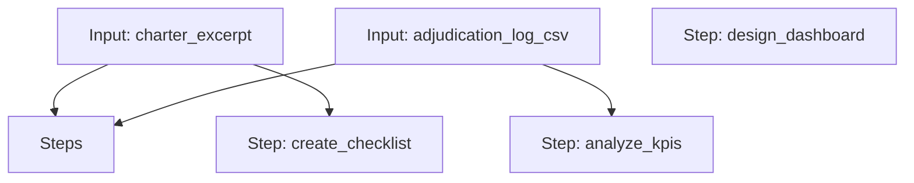

# Adjudication Workflow

A workflow to design an adjudication dashboard, create a source document checklist, and analyze adjudication KPIs.

## Workflow Diagram

[View Source YAML](https://github.com/fderuiter/proompts/blob/main/workflows/clinical/adjudication.workflow.yaml)
