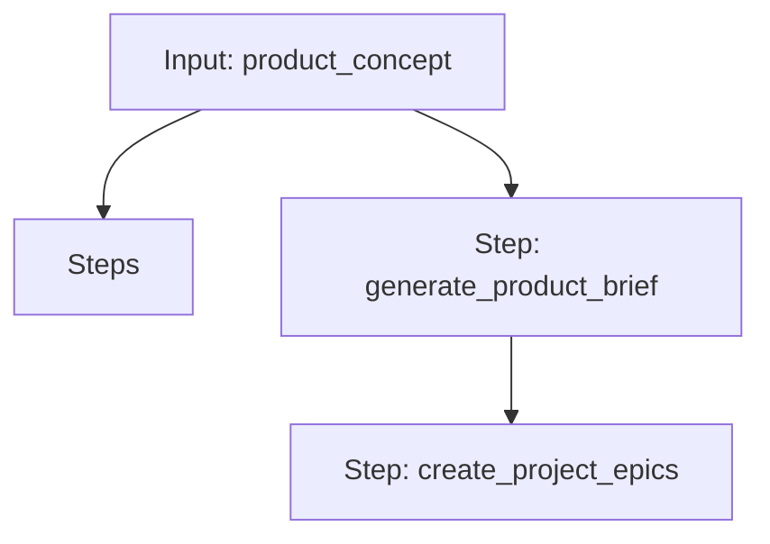

# Agentic Coding: From Idea to Epics

A workflow that takes a product concept, generates a product brief, and then creates project epics from that brief.

## Workflow Diagram

[View Source YAML](https://github.com/fderuiter/proompts/blob/main/workflows/technical/agentic_coding.workflow.yaml)
