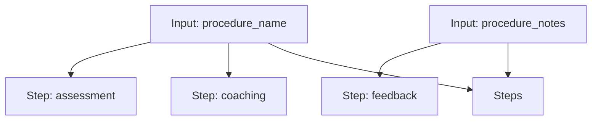

# BioSkills Workflow

A workflow for coaching, feedback, and assessment of bioskills.

## Workflow Diagram

[View Source YAML](https://github.com/fderuiter/proompts/blob/main/workflows/scientific/bioskills.workflow.yaml)
