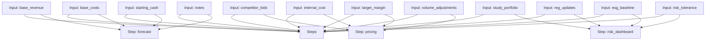

# CFO Workflow

A workflow for financial forecasting, competitive bid pricing, and regulatory risk assessment.

## Workflow Diagram

```mermaid
graph TD
    Input_base_revenue[Input: base_revenue] --> Steps
    Input_base_costs[Input: base_costs] --> Steps
    Input_starting_cash[Input: starting_cash] --> Steps
    Input_notes[Input: notes] --> Steps
    Input_competitor_bids[Input: competitor_bids] --> Steps
    Input_internal_cost[Input: internal_cost] --> Steps
    Input_target_margin[Input: target_margin] --> Steps
    Input_volume_adjustments[Input: volume_adjustments] --> Steps
    Input_study_portfolio[Input: study_portfolio] --> Steps
    Input_reg_updates[Input: reg_updates] --> Steps
    Input_esg_baseline[Input: esg_baseline] --> Steps
    Input_risk_tolerance[Input: risk_tolerance] --> Steps
    forecast[Step: forecast]
    Input_base_revenue --> forecast
    Input_base_costs --> forecast
    Input_starting_cash --> forecast
    Input_notes --> forecast
    pricing[Step: pricing]
    Input_competitor_bids --> pricing
    Input_internal_cost --> pricing
    Input_target_margin --> pricing
    Input_volume_adjustments --> pricing
    risk_dashboard[Step: risk_dashboard]
    Input_study_portfolio --> risk_dashboard
    Input_reg_updates --> risk_dashboard
    Input_esg_baseline --> risk_dashboard
    Input_risk_tolerance --> risk_dashboard
```

[View Source YAML](../../workflows/business/cfo.workflow.yaml)
