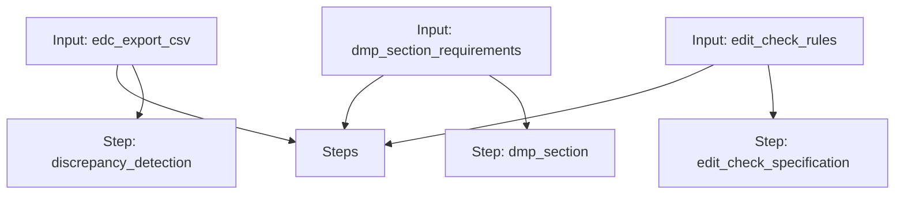

# Clinical Data Workflow

A workflow for detecting discrepancies, drafting a DMP section, and building edit check specifications.

## Workflow Diagram

[View Source YAML](https://github.com/fderuiter/proompts/blob/main/workflows/clinical/clinical_data.workflow.yaml)
