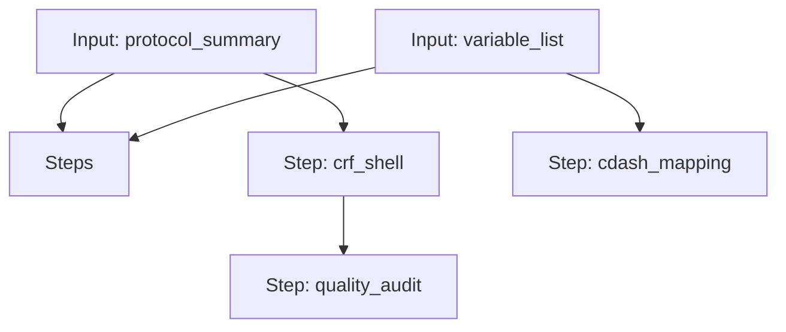

# Clinical Prompts Workflow

A workflow to generate a CRF shell, audit it, and create a CDASH mapping guide.

## Workflow Diagram

[View Source YAML](https://github.com/fderuiter/proompts/blob/main/workflows/clinical/clinical_prompts.workflow.yaml)
