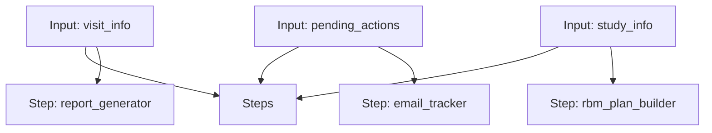

# CRA Workflow

A workflow for generating a monitoring visit report, tracking investigator follow-up emails, and building an RBM plan.

## Workflow Diagram

[View Source YAML](../workflows_src/clinical/cra.workflow.yaml)
