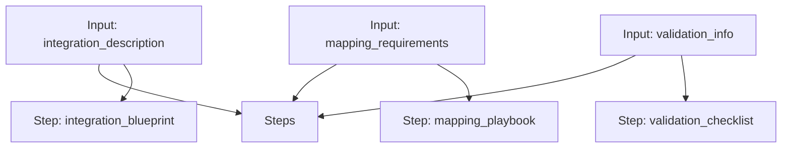

# eClinical Integration Workflow

A workflow for architecting an integration blueprint, creating a data mapping playbook, and compiling a regulatory validation checklist.

## Workflow Diagram

[View Source YAML](../../workflows/clinical/eclinical_integration.workflow.yaml)
