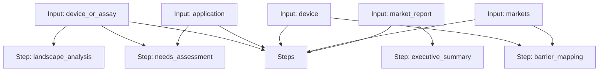

# Market Research Workflow

A workflow for market landscape analysis, user needs assessment, barrier mapping, and executive summary generation.

## Workflow Diagram

[View Source YAML](../workflows_src/business/market_research.workflow.yaml)
