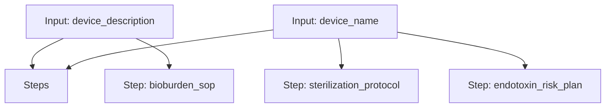

# Microbiology Workflow

A workflow for creating a bioburden testing SOP, an EO sterilization validation protocol, and an endotoxin control risk plan.

## Workflow Diagram

[View Source YAML](https://github.com/fderuiter/proompts/blob/main/workflows/scientific/microbiology.workflow.yaml)
