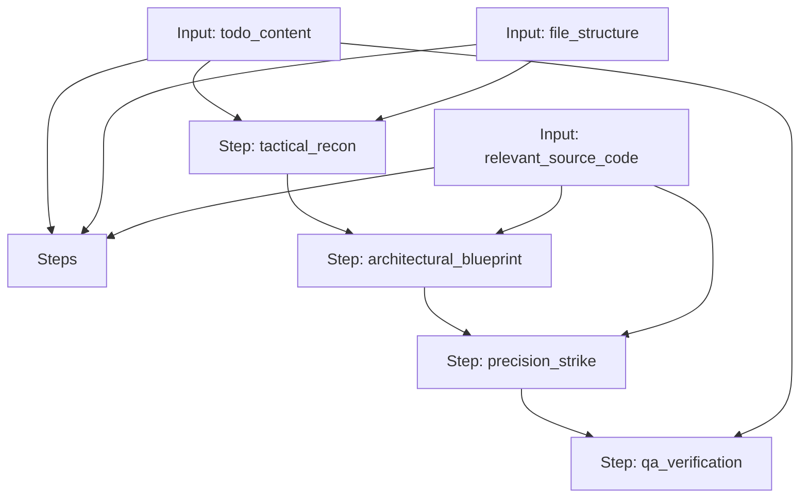

# Principal Architect Workflow (PAW)

A state-machine workflow for disciplined software engineering tasks, enforcing Design, Refactor, Implementation, and QA phases.

## Workflow Diagram

[View Source YAML](../../workflows/technical/software_engineering/paw_workflow.workflow.yaml)
