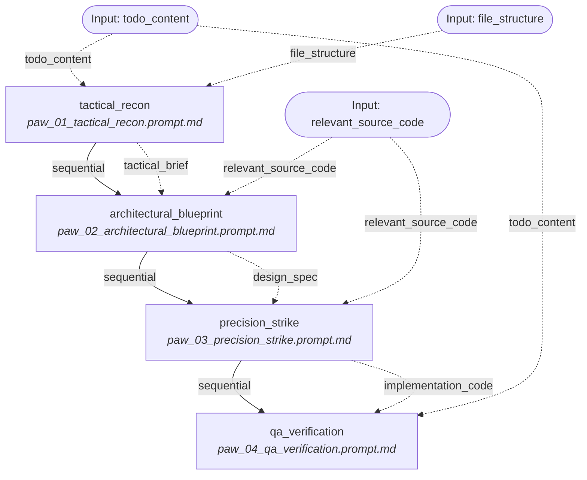

# Principal Architect Workflow (PAW)

A state-machine workflow for disciplined software engineering tasks, enforcing Design, Refactor, Implementation, and QA phases.

## Workflow Diagram

```mermaid
graph TD
    INPUT_todo_content([Input: todo_content])
    INPUT_file_structure([Input: file_structure])
    INPUT_relevant_source_code([Input: relevant_source_code])
    tactical_recon[tactical_recon<br><i>paw_01_tactical_recon.prompt.md</i>]
    INPUT_todo_content -. todo_content .-> tactical_recon
    INPUT_file_structure -. file_structure .-> tactical_recon
    tactical_recon -->|sequential| architectural_blueprint
    architectural_blueprint[architectural_blueprint<br><i>paw_02_architectural_blueprint.prompt.md</i>]
    tactical_recon -. tactical_brief .-> architectural_blueprint
    INPUT_relevant_source_code -. relevant_source_code .-> architectural_blueprint
    architectural_blueprint -->|sequential| precision_strike
    precision_strike[precision_strike<br><i>paw_03_precision_strike.prompt.md</i>]
    architectural_blueprint -. design_spec .-> precision_strike
    INPUT_relevant_source_code -. relevant_source_code .-> precision_strike
    precision_strike -->|sequential| qa_verification
    qa_verification[qa_verification<br><i>paw_04_qa_verification.prompt.md</i>]
    precision_strike -. implementation_code .-> qa_verification
    INPUT_todo_content -. todo_content .-> qa_verification
```

