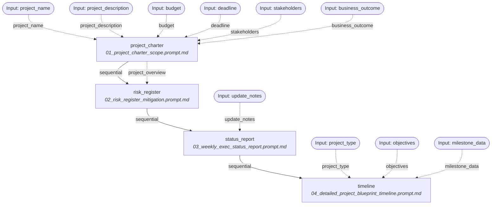

# Project Management Workflow

A workflow to create a project charter, risk register, status report, and timeline.

## Workflow Diagram

```mermaid
graph TD
    INPUT_project_name([Input: project_name])
    INPUT_project_description([Input: project_description])
    INPUT_budget([Input: budget])
    INPUT_deadline([Input: deadline])
    INPUT_stakeholders([Input: stakeholders])
    INPUT_business_outcome([Input: business_outcome])
    INPUT_update_notes([Input: update_notes])
    INPUT_project_type([Input: project_type])
    INPUT_objectives([Input: objectives])
    INPUT_milestone_data([Input: milestone_data])
    project_charter[project_charter<br><i>01_project_charter_scope.prompt.md</i>]
    INPUT_project_name -. project_name .-> project_charter
    INPUT_project_description -. project_description .-> project_charter
    INPUT_budget -. budget .-> project_charter
    INPUT_deadline -. deadline .-> project_charter
    INPUT_stakeholders -. stakeholders .-> project_charter
    INPUT_business_outcome -. business_outcome .-> project_charter
    project_charter -->|sequential| risk_register
    risk_register[risk_register<br><i>02_risk_register_mitigation.prompt.md</i>]
    project_charter -. project_overview .-> risk_register
    risk_register -->|sequential| status_report
    status_report[status_report<br><i>03_weekly_exec_status_report.prompt.md</i>]
    INPUT_update_notes -. update_notes .-> status_report
    status_report -->|sequential| timeline
    timeline[timeline<br><i>04_detailed_project_blueprint_timeline.prompt.md</i>]
    INPUT_project_type -. project_type .-> timeline
    INPUT_objectives -. objectives .-> timeline
    INPUT_milestone_data -. milestone_data .-> timeline
```

