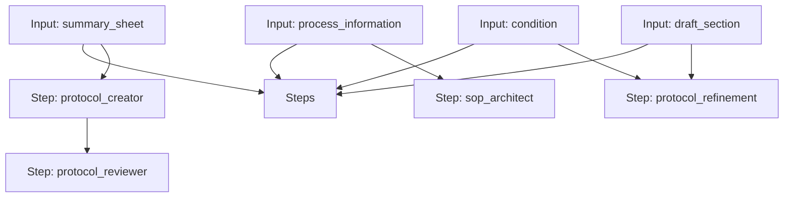

# Protocol Workflow

A workflow to create, review, and refine a clinical trial protocol.

## Workflow Diagram

[View Source YAML](https://github.com/fderuiter/proompts/blob/main/workflows/clinical/protocol.workflow.yaml)
