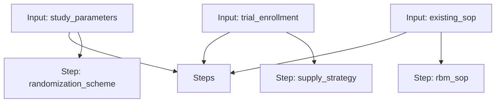

# RTSM Workflow

A workflow for designing a randomization scheme, a supply strategy, and a risk-based monitoring SOP.

## Workflow Diagram

[View Source YAML](https://github.com/fderuiter/proompts/blob/main/workflows/clinical/rtsm.workflow.yaml)
