# Site Acquisition Workflow

A workflow for site landscape mapping, feasibility questionnaire building, and investigator outreach.

## Workflow Diagram

```mermaid
graph TD
    Input_protocol_summary[Input: protocol_summary] --> Steps
    Input_investigator_name[Input: investigator_name] --> Steps
    Input_site_name[Input: site_name] --> Steps
    Input_city_country[Input: city_country] --> Steps
    Input_recent_relevant_trials[Input: recent_relevant_trials] --> Steps
    Input_unique_site_strength[Input: unique_site_strength] --> Steps
    Input_study_synopsis[Input: study_synopsis] --> Steps
    Input_sponsor_name[Input: sponsor_name] --> Steps
    site_mapping[Step: site_mapping]
    Input_protocol_summary --> site_mapping
    feasibility_questionnaire[Step: feasibility_questionnaire]
    Input_protocol_summary --> feasibility_questionnaire
    outreach_email[Step: outreach_email]
    Input_investigator_name --> outreach_email
    Input_site_name --> outreach_email
    Input_city_country --> outreach_email
    Input_recent_relevant_trials --> outreach_email
    Input_unique_site_strength --> outreach_email
    Input_study_synopsis --> outreach_email
    Input_sponsor_name --> outreach_email
```

[View Source YAML](../workflows_src/clinical/site_acquisition.workflow.yaml)
