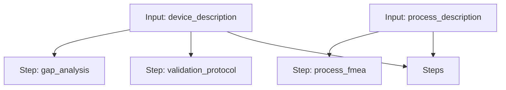

# Sterility Workflow

A workflow for building a sterility validation protocol, comparing regulatory gaps, and performing a process FMEA.

## Workflow Diagram

[View Source YAML](../../workflows/scientific/sterility.workflow.yaml)
