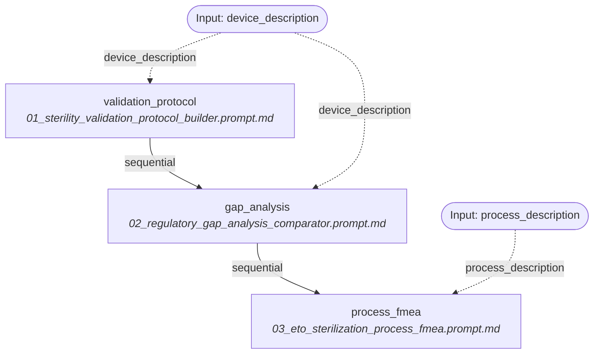

# Sterility Workflow

A workflow for building a sterility validation protocol, comparing regulatory gaps, and performing a process FMEA.

## Workflow Diagram

```mermaid
graph TD
    INPUT_device_description([Input: device_description])
    INPUT_process_description([Input: process_description])
    validation_protocol[validation_protocol<br><i>01_sterility_validation_protocol_builder.prompt.md</i>]
    INPUT_device_description -. device_description .-> validation_protocol
    validation_protocol -->|sequential| gap_analysis
    gap_analysis[gap_analysis<br><i>02_regulatory_gap_analysis_comparator.prompt.md</i>]
    INPUT_device_description -. device_description .-> gap_analysis
    gap_analysis -->|sequential| process_fmea
    process_fmea[process_fmea<br><i>03_eto_sterilization_process_fmea.prompt.md</i>]
    INPUT_process_description -. process_description .-> process_fmea
```

