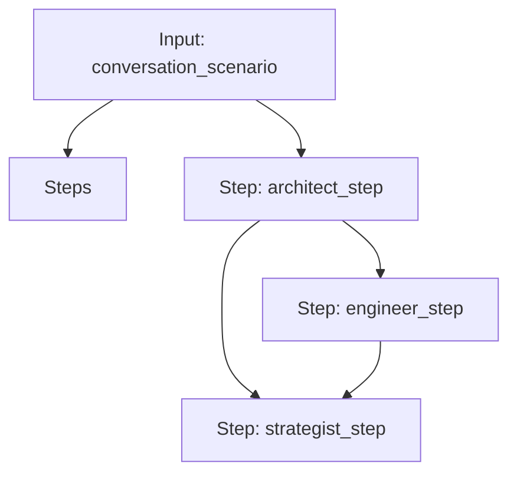

# Stochastic Model Chain: Architect -> Engineer -> Strategist

A three-stage workflow to model, simulate, and analyze conversation risks using Game Theory and Monte Carlo simulations.

## Workflow Diagram

[View Source YAML](../../workflows/technical/stochastic_model_chain.workflow.yaml)
