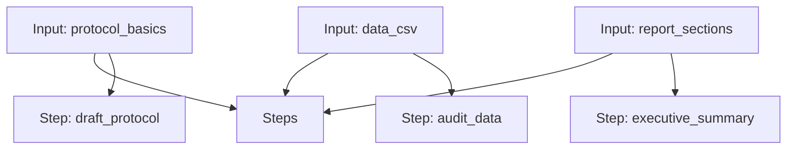

# Study Director Workflow

A workflow for drafting a GLP-compliant study protocol, auditing raw data, and generating an executive summary.

## Workflow Diagram

[View Source YAML](../../workflows/management/study_director.workflow.yaml)
