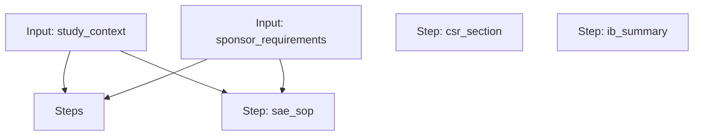

# Technical Writer Workflow

A workflow for drafting a CSR results and safety section, an Investigator's Brochure summary of changes, and an SAE reporting SOP.

## Workflow Diagram

[View Source YAML](../../workflows/technical/technical_writer.workflow.yaml)
