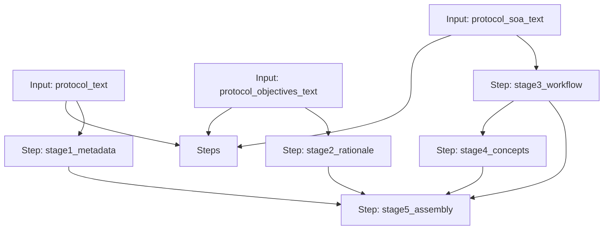

# Protocol to USDM Workflow

A 5-stage chain to convert unstructured Clinical Protocol text into CDISC USDM v3.0 JSON.

## Workflow Diagram

[View Source YAML](https://github.com/fderuiter/proompts/blob/main/workflows/clinical/usdm_workflow.workflow.yaml)
