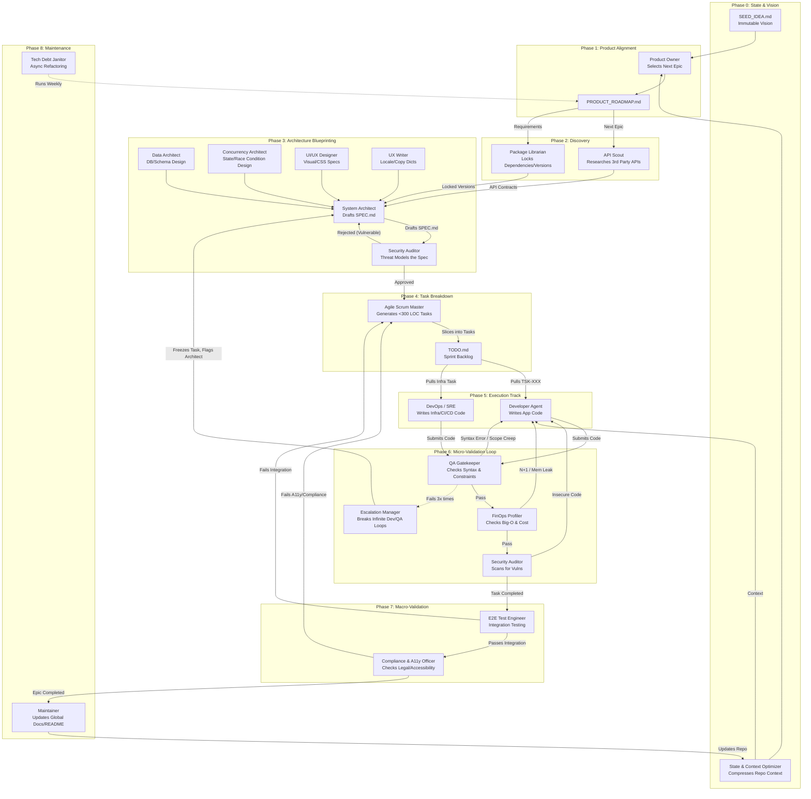

# Google Jules Overview

## Prompts
- **[Jules Agile Orchestrator](jules_agile_orchestrator.prompt.yaml)**: AI Product Engineering Lead for Agile project management, backlog refinement, and atomic task decomposition.
- **[Jules API Scout](jules_api_scout.prompt.yaml)**: AI Integration Specialist for researching live API contracts to prevent hallucinations.
- **[Jules Compliance Officer](jules_compliance_officer.prompt.yaml)**: AI Risk Mitigator for ensuring accessibility, privacy, and legal compliance.
- **[Jules Concurrency Architect](jules_concurrency_architect.prompt.yaml)**: AI State Management Architect for defining async flows and race condition handling.
- **[Jules Data Architect](jules_data_architect.prompt.yaml)**: AI Database Architect for designing schemas, migrations, and indexing strategies.
- **[Jules Developer Agent](jules_developer_agent.prompt.yaml)**: AI Software Engineer for executing specific tasks with strict adherence to technical specs and scope constraints.
- **[Jules DevOps Engineer](jules_devops_engineer.prompt.yaml)**: AI Site Reliability Engineer for CI/CD, containerization, and deployment.
- **[Jules E2E Test Engineer](jules_e2e_test_engineer.prompt.yaml)**: AI Test Automation Engineer for writing end-to-end integration tests.
- **[Jules FinOps Profiler](jules_finops_profiler.prompt.yaml)**: AI Performance Watchdog for detecting resource inefficiencies and cost risks.
- **[Jules Maintainer](jules_maintainer.prompt.yaml)**: AI Documentation Maintainer for syncing codebase reality with documentation.
- **[Jules Orchestrator](jules_orchestrator.prompt.yaml)**: Lead AI Technical Project Manager & Architect for state analysis, documentation enhancement, and atomic task decomposition.
- **[Jules Product Architect](jules_product_architect.prompt.yaml)**: AI Product Architect for translating seed visions into high-level execution roadmaps.
- **[Jules QA Gatekeeper](jules_qa_gatekeeper.prompt.yaml)**: AI Quality Control Agent for validating developer code against specs and constraints.
- **[Jules Security Auditor](jules_security_auditor.prompt.yaml)**: AI DevSecOps agent for auditing specs and code for security vulnerabilities.
- **[Jules System Designer](jules_system_designer.prompt.yaml)**: AI Lead System Designer for creating rigid technical specifications from high-level Epics.
- **[Jules Test Generator](jules_test_gen.prompt.yaml)**: A specialized prompt for Google Jules to autonomously generate comprehensive test suites for existing code, ensuring high coverage and reliability.
- **[Jules UX Writer](jules_ux_writer.prompt.yaml)**: AI Localization Expert for generating professional copy and error messages.

## The Master AI Factory Architecture

Here is the complete, interwoven architecture. To make this autonomous system actually work without collapsing under its own weight, it cannot be a simple straight line. It requires nested feedback loops, parallel execution tracks, and strict gatekeepers that block bad code before it pollutes the master branch.

Below is the detailed Mermaid.js diagram mapping out the entire 20-agent data flow.

### How the Flow Executes (The Critical Paths)

1. **The Context Injection (Phase 0):** Instead of feeding the whole repo to every agent, the **State Optimizer** generates a compressed map. This sits outside the main flow and feeds precise context to the Product Owner and Developers, drastically cutting token costs and preventing "goldfish memory."
2. **The Blueprint Bottleneck (Phase 3):** Notice how the System Architect cannot finalize the `SPEC.md` until the API Scout, Data Architect, and UX Designers provide their pieces. Furthermore, the **Security Auditor** blocks the spec from moving to task generation if the architecture is fundamentally insecure. This is cheaper than fixing vulnerable code later.
3. **The Micro-Validation Loop (Phase 5 & 6):** This is the engine room. The Developer submits code. It must pass QA (syntax/scope), FinOps (performance), and Security (vulnerabilities). If any fail, the code is bounced back to the Developer.
4. **The Deadlock Breaker:** The dotted line to the **Escalation Manager**. If the Developer and QA agent get stuck in an infinite loop fighting over a bug, the Escalation Manager steps in, kills the task, and routes the failure back up to the System Architect to fix the flawed specification.
5. **The Macro-Validation (Phase 7):** Individual tasks passing QA doesn't mean the app works. The E2E Tester and Compliance Officer test the entire Epic together. If they find an integration bug or an accessibility violation, they don't fix it—they create new tasks and inject them back into the Scrum Master's backlog.
