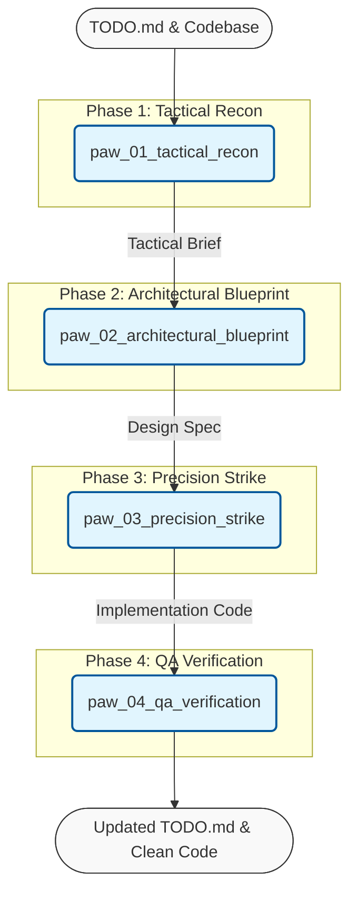

# Paw Overview

> [!NOTE]
> The **Principal Architect Workflow (PAW)** is a state-machine workflow for disciplined software engineering tasks, enforcing Design, Refactor, Implementation, and QA phases.

## 🗺️ Workflow Architecture

## Prompts

- **[PAW Phase 1 - Tactical Recon](paw_01_tactical_recon.prompt.yaml)**: Phase 1 of the Principal Architect Workflow (PAW). Analyzes TODO.md and file structure to generate a Tactical Brief.
- **[PAW Phase 2 - Architectural Blueprint](paw_02_architectural_blueprint.prompt.yaml)**: Phase 2 of the Principal Architect Workflow (PAW). Designs the solution based on the Tactical Brief.
- **[PAW Phase 3 - Precision Strike](paw_03_precision_strike.prompt.yaml)**: Phase 3 of the Principal Architect Workflow (PAW). Implements the design spec with surgical accuracy.
- **[PAW Phase 4 - Quality Assurance & Log](paw_04_qa_verification.prompt.yaml)**: Phase 4 of the Principal Architect Workflow (PAW). Verifies the implementation and updates the TODO log.
