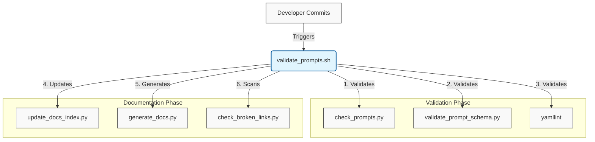

# Developer Scripts & Utilities 🧰

> [!NOTE]
> **TL;DR - Quickstart for Validation**
> Before committing any changes, run the master validation script from the repository root to check schemas, formatting, and update documentation:
> ```bash
> ./scripts/validate_prompts.sh
> ```

## What is this?
This directory is the "Engine Room" of the Proompts repository. It contains the core Python scripts responsible for CI/CD validation, workflow simulation, schema enforcement, and automated documentation generation.

## Why does it exist?
To maintain high standards across the prompt library. By automating schema checks and documentation generation, these scripts reduce manual overhead and prevent "Documentation Debt."

## How does it work?
The scripts operate as a pipeline. The master script (`validate_prompts.sh`) acts as the entry point, orchestrating validation and documentation tasks.

### The CI/CD Pipeline



## Prerequisites

Before running these scripts, ensure you have the required dependencies installed:

```bash
pip install -r requirements.txt
```

## 🗺️ Directory Map

| Path | Type | Description |
| :--- | :--- | :--- |
| **`check_broken_links.py`** | 🐍 Python | 🔗 Broken Link Checker |
| **`check_prompts.py`** | 🐍 Python | Repository Checks for Prompt Files |
| **`enrich_prompts.py`** | 🐍 Python | Enrich Prompt Files - Automation Script |
| **`fix_markdown_issues.py`** | 🐍 Python | Automatically fix common Markdown issues listed in todo_fix.md. |
| **`generate_docs.py`** | 🐍 Python | This script generates the static Markdown documentation site structure in the `docs/` directory. It scans all prompts and workflows, organizes them by category (metadata-driven), and builds category index pages and individual workflow documentation pages. |
| **`generate_overviews.py`** | 🐍 Python | Create ``overview.md`` files for prompt directories if missing. |
| **`generate_regulatory_prompts.py`** | 🐍 Python | Generate regulatory prompts based on a predefined list of tasks. |
| **`generate_search_index.py`** | 🐍 Python | Generates a search.json index for the static site. |
| **`governance_manifest_generator.py`** | 🐍 Python | This script scans prompt files and generates a regulatory compliance manifest (`compliance_manifest.json`) and a gap report (`gap_report.json`) against predefined standards like 21 CFR Part 11 and ISO 13485. |
| **`inject_test_data.py`** | 🐍 Python | This script scans all `.workflow.yaml` files in the `workflows/` directory. If a workflow is missing the `testData` field, it automatically inspects the required inputs from the step mappings and injects a mock `testData` block. |
| **`migrate_prompts.py`** | 🐍 Python | Migrate Prompts - Schema Evolution Script |
| **`run_workflow.py`** | 🐍 Python | This script loads a `.workflow.yaml` file, parses the step execution order, resolves inter-step variable mappings, and simulates the output of each prompt. |
| **`search_prompts.py`** | 🐍 Python | Search prompts by keyword. |
| **`standardize_c_prompts.py`** | 🐍 Python | No description provided. |
| **`test_check_broken_links.py`** | 🐍 Python | No description provided. |
| **`test_check_prompts.py`** | 🐍 Python | Test check_overview when OVERVIEW_NAME exists. |
| **`test_enrich_prompts.py`** | 🐍 Python | Test with an empty dictionary. |
| **`test_fix_markdown_issues.py`** | 🐍 Python | No description provided. |
| **`test_generate_docs.py`** | 🐍 Python | Test file in the root directory returns Uncategorized. |
| **`test_generate_overviews.py`** | 🐍 Python | Test metadata extraction when 'name' is present in YAML. |
| **`test_generate_regulatory_prompts.py`** | 🐍 Python | No description provided. |
| **`test_generate_search_index.py`** | 🐍 Python | No description provided. |
| **`test_migrate_prompts.py`** | 🐍 Python | Test extraction of simple template variables. |
| **`test_print.py`** | 🐍 Python | No description provided. |
| **`test_render_workflow.py`** | 🐍 Python | No description provided. |
| **`test_run_workflow.py`** | 🐍 Python | Creates a temporary directory and mock prompt/workflow files. |
| **`test_run_workflow_unit.py`** | 🐍 Python | Test simple variable substitution. |
| **`test_search_prompts.py`** | 🐍 Python | No description provided. |
| **`test_update_docs_index.py`** | 🐍 Python | No description provided. |
| **`test_update_last_modified.py`** | 🐍 Python | Test update_file returns False and logs an error when reading fails. |
| **`test_utils.py`** | 🐍 Python | Test load_yaml with valid YAML content. |
| **`test_validate_prompt_schema.py`** | 🐍 Python | Test that a valid schema passes validation. |
| **`test_workflows.py`** | 🐍 Python | Test Workflows Script |
| **`update_docs_index.py`** | 🐍 Python | Update `docs/index.md` and `docs/table-of-contents.md` from prompt metadata. |
| **`update_last_modified.py`** | 🐍 Python | This script updates the `last_modified` metadata field in prompt YAML files to the current UTC time. If the field is missing, it injects it at the top of the file (or immediately after the `name` field). |
| **`validate_docs_snippets.py`** | 🐍 Python | Lightweight Script Validator |
| **`validate_prompt_schema.py`** | 🐍 Python | Validate Prompt Schema & Generate JSON Schema |

## Core Simulation & Governance Scripts

### `governance_manifest_generator.py`

**Description:** This script scans prompt files and generates a regulatory compliance manifest (`compliance_manifest.json`) and a gap report (`gap_report.json`) against predefined standards like 21 CFR Part 11 and ISO 13485.

**Usage Example:**
```bash
python3 tools/tools/scripts/governance_manifest_generator.py
```
### `run_workflow.py`

**Description:** This script loads a `.workflow.yaml` file, parses the step execution order, resolves inter-step variable mappings, and simulates the output of each prompt.

**Usage Example:**
```bash
# Simulate a workflow with verbose output
python3 tools/tools/scripts/run_workflow.py path/to/workflow.workflow.yaml -v

# Simulate with initial inputs
python3 tools/tools/scripts/run_workflow.py path/to/workflow.workflow.yaml -i user_name="Alice"

Parameters:
  workflow_file : Path to the `.workflow.yaml` file
  -i, --input   : Initial input variables (key=value)
  -v, --verbose : Enable verbose logging
```
---

[Return to Documentation Index](../../docs/index.md)
