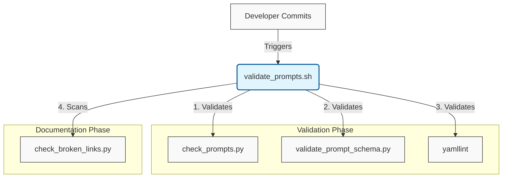

# Developer Scripts & Utilities 🧰

> [!NOTE]
> **TL;DR - Quickstart for Validation**
> Before committing any changes, run the master validation script from the repository root to check schemas, formatting, and update documentation:
> ```bash
> ./scripts/validate_prompts.sh
> ```

## What is this?
This directory is the "Engine Room" of the Proompts repository. It contains the core Python scripts responsible for CI/CD validation, workflow simulation, schema enforcement, and automated documentation generation.

## Why does it exist?
To maintain high standards across the prompt library. By automating schema checks and documentation generation, these scripts reduce manual overhead and prevent "Documentation Debt."

## How does it work?
The scripts operate as a pipeline. The master script (`validate_prompts.sh`) acts as the entry point, orchestrating validation and documentation tasks.

### The CI/CD Pipeline



## Prerequisites

Before running these scripts, ensure you have the required dependencies installed:

```bash
pip install -r requirements.txt
```

## 🗺️ Directory Map

| Path | Type | Description |
| :--- | :--- | :--- |
| **`check_broken_links.py`** | 🐍 Python | Broken Link Checker |
| **`enrich_prompts.py`** | 🐍 Python | Enrich Prompt Files - Automation Script |
| **`fix_markdown_issues.py`** | 🐍 Python | Fix Markdown Issues Script |
| **`generate_overviews.py`** | 🐍 Python | Generate Overviews Script |
| **`generate_search_index.py`** | 🐍 Python | Generate Search Index Script |
| **`governance_manifest_generator.py`** | 🐍 Python | This script scans prompt files and generates a regulatory compliance manifest (`compliance_manifest.json`) and a gap report (`gap_report.json`) against predefined standards like 21 CFR Part 11 and ISO 13485. |
| **`inject_test_data.py`** | 🐍 Python | This script scans all `.workflow.yaml` files in the `workflows/` directory. If a workflow is missing the `testData` field, it automatically inspects the required inputs from the step mappings and injects a mock `testData` block. > [!WARNING] > Manual Setup Required: > This script currently hardcodes the target path as `/app/workflows/`, which is not a standard repository directory unless you are running inside a specific container structure. You must manually ensure this path exists or modify the script locally before execution. |
| **`test_check_broken_links.py`** | 🐍 Python | No description provided. |
| **`test_enrich_prompts.py`** | 🐍 Python | Test with an empty dictionary. |
| **`test_fix_markdown_issues.py`** | 🐍 Python | No description provided. |
| **`test_generate_overviews.py`** | 🐍 Python | Test metadata extraction when 'name' is present in YAML. |
| **`test_generate_search_index.py`** | 🐍 Python | No description provided. |
| **`test_print.py`** | 🐍 Python | No description provided. |
| **`test_workflows.py`** | 🐍 Python | Test Workflows Script |

## Core Simulation & Governance Scripts

### `governance_manifest_generator.py`

**Description:** This script scans prompt files and generates a regulatory compliance manifest (`compliance_manifest.json`) and a gap report (`gap_report.json`) against predefined standards like 21 CFR Part 11 and ISO 13485.

**Usage Example:**
```bash
python3 tools/tools/scripts/governance_manifest_generator.py
```
---

[Return to Documentation Index](../../docs/index.md)
