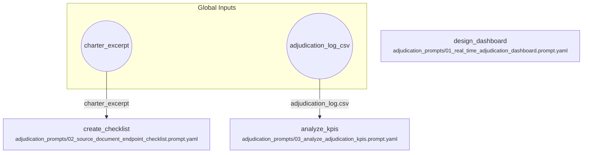

# Adjudication Workflow

A workflow to design an adjudication dashboard, create a source document checklist, and analyze adjudication KPIs.

## Visual Flow

```mermaid
flowchart TD
    subgraph Inputs [Global Inputs]
        inp_charter_excerpt((charter_excerpt))
        inp_adjudication_log_csv((adjudication_log_csv))
    end
    design_dashboard["design_dashboard<br/><small>adjudication_prompts/01_real_time_adjudication_dashboard.prompt.yaml</small>"]
    create_checklist["create_checklist<br/><small>adjudication_prompts/02_source_document_endpoint_checklist.prompt.yaml</small>"]
    analyze_kpis["analyze_kpis<br/><small>adjudication_prompts/03_analyze_adjudication_kpis.prompt.yaml</small>"]
    inp_charter_excerpt -->|charter_excerpt| create_checklist
    inp_adjudication_log_csv -->|adjudication_log.csv| analyze_kpis
```
