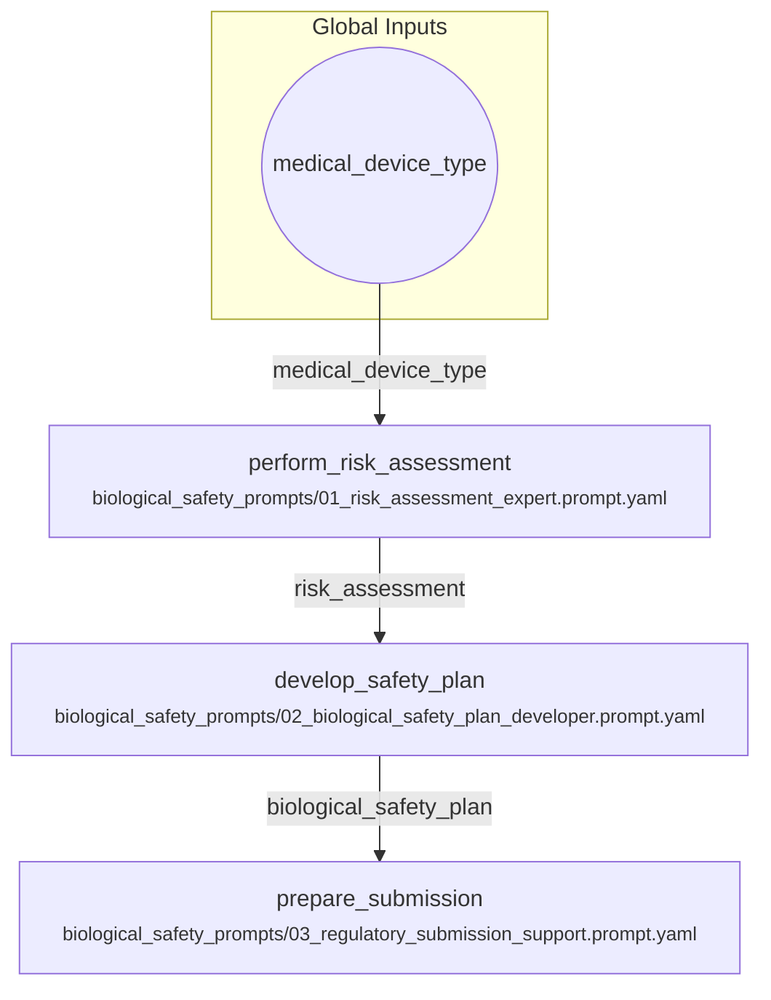

# Biological Safety Assessment and Planning

A workflow to perform a risk assessment for a medical device, develop a biological safety plan, and prepare for regulatory submission. This follows the sequence in the biological_safety_prompts directory.

## Visual Flow

