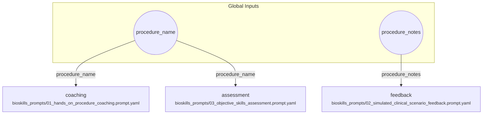

# BioSkills Workflow

A workflow for coaching, feedback, and assessment of bioskills.

## Visual Flow

```mermaid
flowchart TD
    subgraph Inputs [Global Inputs]
        inp_procedure_name((procedure_name))
        inp_procedure_notes((procedure_notes))
    end
    coaching["coaching<br/><small>bioskills_prompts/01_hands_on_procedure_coaching.prompt.yaml</small>"]
    feedback["feedback<br/><small>bioskills_prompts/02_simulated_clinical_scenario_feedback.prompt.yaml</small>"]
    assessment["assessment<br/><small>bioskills_prompts/03_objective_skills_assessment.prompt.yaml</small>"]
    inp_procedure_name -->|procedure_name| coaching
    inp_procedure_notes -->|procedure_notes| feedback
    inp_procedure_name -->|procedure_name| assessment
```
