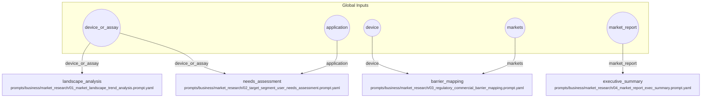

# Market Research Workflow

A workflow for market landscape analysis, user needs assessment, barrier mapping, and executive summary generation.

## Visual Flow

```mermaid
flowchart TD
    subgraph Inputs [Global Inputs]
        inp_device_or_assay((device_or_assay))
        inp_application((application))
        inp_device((device))
        inp_markets((markets))
        inp_market_report((market_report))
    end
    landscape_analysis["landscape_analysis<br/><small>prompts/business/market_research/01_market_landscape_trend_analysis.prompt.yaml</small>"]
    needs_assessment["needs_assessment<br/><small>prompts/business/market_research/02_target_segment_user_needs_assessment.prompt.yaml</small>"]
    barrier_mapping["barrier_mapping<br/><small>prompts/business/market_research/03_regulatory_commercial_barrier_mapping.prompt.yaml</small>"]
    executive_summary["executive_summary<br/><small>prompts/business/market_research/04_market_report_exec_summary.prompt.yaml</small>"]
    inp_device_or_assay -->|device_or_assay| landscape_analysis
    inp_device_or_assay -->|device_or_assay| needs_assessment
    inp_application -->|application| needs_assessment
    inp_device -->|device| barrier_mapping
    inp_markets -->|markets| barrier_mapping
    inp_market_report -->|market_report| executive_summary
```
