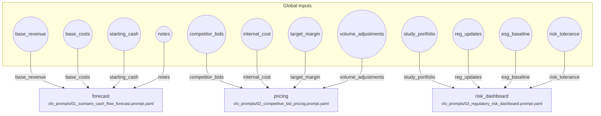

# CFO Workflow

A workflow for financial forecasting, competitive bid pricing, and regulatory risk assessment.

## Visual Flow

```mermaid
flowchart TD
    subgraph Inputs [Global Inputs]
        inp_base_revenue((base_revenue))
        inp_base_costs((base_costs))
        inp_starting_cash((starting_cash))
        inp_notes((notes))
        inp_competitor_bids((competitor_bids))
        inp_internal_cost((internal_cost))
        inp_target_margin((target_margin))
        inp_volume_adjustments((volume_adjustments))
        inp_study_portfolio((study_portfolio))
        inp_reg_updates((reg_updates))
        inp_esg_baseline((esg_baseline))
        inp_risk_tolerance((risk_tolerance))
    end
    forecast["forecast<br/><small>cfo_prompts/01_scenario_cash_flow_forecast.prompt.yaml</small>"]
    pricing["pricing<br/><small>cfo_prompts/02_competitive_bid_pricing.prompt.yaml</small>"]
    risk_dashboard["risk_dashboard<br/><small>cfo_prompts/03_regulatory_risk_dashboard.prompt.yaml</small>"]
    inp_base_revenue -->|base_revenue| forecast
    inp_base_costs -->|base_costs| forecast
    inp_starting_cash -->|starting_cash| forecast
    inp_notes -->|notes| forecast
    inp_competitor_bids -->|competitor_bids| pricing
    inp_internal_cost -->|internal_cost| pricing
    inp_target_margin -->|target_margin| pricing
    inp_volume_adjustments -->|volume_adjustments| pricing
    inp_study_portfolio -->|study_portfolio| risk_dashboard
    inp_reg_updates -->|reg_updates| risk_dashboard
    inp_esg_baseline -->|esg_baseline| risk_dashboard
    inp_risk_tolerance -->|risk_tolerance| risk_dashboard
```
