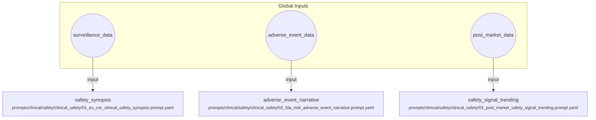

# Clinical Safety Workflow

A workflow for creating a clinical safety synopsis, an adverse event narrative, and trending safety signals.

## Visual Flow

```mermaid
flowchart TD
    subgraph Inputs [Global Inputs]
        inp_surveillance_data((surveillance_data))
        inp_adverse_event_data((adverse_event_data))
        inp_post_market_data((post_market_data))
    end
    safety_synopsis["safety_synopsis<br/><small>prompts/clinical/safety/clinical_safety/01_eu_cer_clinical_safety_synopsis.prompt.yaml</small>"]
    adverse_event_narrative["adverse_event_narrative<br/><small>prompts/clinical/safety/clinical_safety/02_fda_mdr_adverse_event_narrative.prompt.yaml</small>"]
    safety_signal_trending["safety_signal_trending<br/><small>prompts/clinical/safety/clinical_safety/03_post_market_safety_signal_trending.prompt.yaml</small>"]
    inp_surveillance_data -->|input| safety_synopsis
    inp_adverse_event_data -->|input| adverse_event_narrative
    inp_post_market_data -->|input| safety_signal_trending
```
