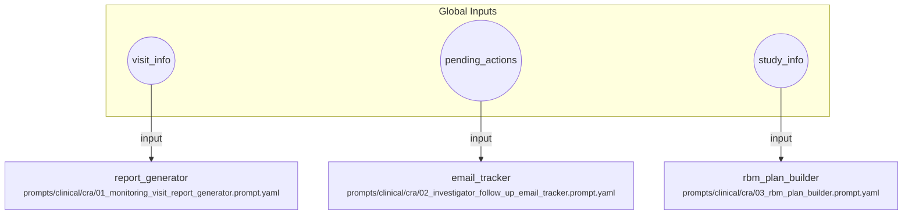

# CRA Workflow

A workflow for generating a monitoring visit report, tracking investigator follow-up emails, and building an RBM plan.

## Visual Flow

```mermaid
flowchart TD
    subgraph Inputs [Global Inputs]
        inp_visit_info((visit_info))
        inp_pending_actions((pending_actions))
        inp_study_info((study_info))
    end
    report_generator["report_generator<br/><small>prompts/clinical/cra/01_monitoring_visit_report_generator.prompt.yaml</small>"]
    email_tracker["email_tracker<br/><small>prompts/clinical/cra/02_investigator_follow_up_email_tracker.prompt.yaml</small>"]
    rbm_plan_builder["rbm_plan_builder<br/><small>prompts/clinical/cra/03_rbm_plan_builder.prompt.yaml</small>"]
    inp_visit_info -->|input| report_generator
    inp_pending_actions -->|input| email_tracker
    inp_study_info -->|input| rbm_plan_builder
```
