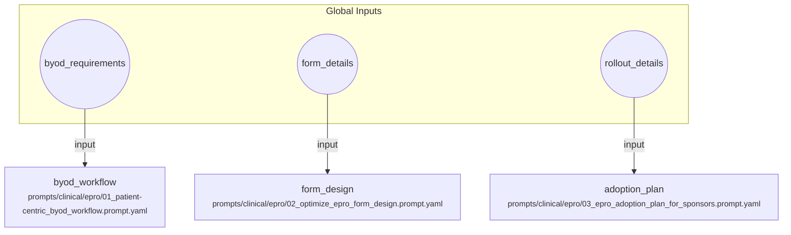

# ePRO Workflow

A workflow for designing a patient-centric BYOD workflow, optimizing ePRO form design, and creating an ePRO adoption plan.

## Visual Flow

```mermaid
flowchart TD
    subgraph Inputs [Global Inputs]
        inp_byod_requirements((byod_requirements))
        inp_form_details((form_details))
        inp_rollout_details((rollout_details))
    end
    byod_workflow["byod_workflow<br/><small>prompts/clinical/epro/01_patient-centric_byod_workflow.prompt.yaml</small>"]
    form_design["form_design<br/><small>prompts/clinical/epro/02_optimize_epro_form_design.prompt.yaml</small>"]
    adoption_plan["adoption_plan<br/><small>prompts/clinical/epro/03_epro_adoption_plan_for_sponsors.prompt.yaml</small>"]
    inp_byod_requirements -->|input| byod_workflow
    inp_form_details -->|input| form_design
    inp_rollout_details -->|input| adoption_plan
```
