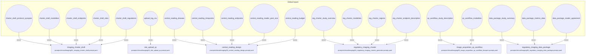

# Imaging Workflow

A workflow for various imaging-related tasks, including charter drafting, QC, central reading design, and regulatory packaging.

## Visual Flow

```mermaid
flowchart TD
    subgraph Inputs [Global Inputs]
        inp_charter_draft_protocol_synopsis((charter_draft_protocol_synopsis))
        inp_charter_draft_modalities((charter_draft_modalities))
        inp_charter_draft_endpoints((charter_draft_endpoints))
        inp_charter_draft_sites((charter_draft_sites))
        inp_charter_draft_regulations((charter_draft_regulations))
        inp_upload_log_csv((upload_log_csv))
        inp_central_reading_disease((central_reading_disease))
        inp_central_reading_timepoints((central_reading_timepoints))
        inp_central_reading_endpoints((central_reading_endpoints))
        inp_central_reading_reader_pool_size((central_reading_reader_pool_size))
        inp_central_reading_budget((central_reading_budget))
        inp_reg_charter_study_overview((reg_charter_study_overview))
        inp_reg_charter_modalities((reg_charter_modalities))
        inp_reg_charter_regions((reg_charter_regions))
        inp_reg_charter_endpoint_description((reg_charter_endpoint_description))
        inp_qc_workflow_study_description((qc_workflow_study_description))
        inp_qc_workflow_modalities((qc_workflow_modalities))
        inp_data_package_study_summary((data_package_study_summary))
        inp_data_package_metrics_data((data_package_metrics_data))
        inp_data_package_reader_agreement((data_package_reader_agreement))
    end
    imaging_charter_draft["imaging_charter_draft<br/><small>prompts/clinical/imaging/01_imaging_charter_draft.prompt.yaml</small>"]
    site_upload_qc["site_upload_qc<br/><small>prompts/clinical/imaging/02_site_upload_qc.prompt.yaml</small>"]
    central_reading_design["central_reading_design<br/><small>prompts/clinical/imaging/03_central_reading_design.prompt.yaml</small>"]
    regulatory_imaging_charter["regulatory_imaging_charter<br/><small>prompts/clinical/imaging/04_regulatory_imaging_charter_generator.prompt.yaml</small>"]
    image_acquisition_qc_workflow["image_acquisition_qc_workflow<br/><small>prompts/clinical/imaging/05_image_acquisition_qc_workflow_blueprint.prompt.yaml</small>"]
    regulatory_imaging_data_package["regulatory_imaging_data_package<br/><small>prompts/clinical/imaging/06_regulatory_imaging_data_package.prompt.yaml</small>"]
    inp_charter_draft_protocol_synopsis -->|<<<protocol_synopsis>>>| imaging_charter_draft
    inp_charter_draft_modalities -->|<<<modalities>>>| imaging_charter_draft
    inp_charter_draft_endpoints -->|<<<endpoints>>>| imaging_charter_draft
    inp_charter_draft_sites -->|<<<sites>>>| imaging_charter_draft
    inp_charter_draft_regulations -->|<<<regulations>>>| imaging_charter_draft
    inp_upload_log_csv -->|<<<upload_log.csv>>>| site_upload_qc
    inp_central_reading_disease -->|<<<disease>>>| central_reading_design
    inp_central_reading_timepoints -->|<<<timepoints>>>| central_reading_design
    inp_central_reading_endpoints -->|<<<endpoints>>>| central_reading_design
    inp_central_reading_reader_pool_size -->|<<<reader_pool_size>>>| central_reading_design
    inp_central_reading_budget -->|<<<budget>>>| central_reading_design
    inp_reg_charter_study_overview -->|<<<study_overview>>>| regulatory_imaging_charter
    inp_reg_charter_modalities -->|<<<modalities>>>| regulatory_imaging_charter
    inp_reg_charter_regions -->|<<<regions>>>| regulatory_imaging_charter
    inp_reg_charter_endpoint_description -->|<<<endpoint_description>>>| regulatory_imaging_charter
    inp_qc_workflow_study_description -->|<<<study_description>>>| image_acquisition_qc_workflow
    inp_qc_workflow_modalities -->|<<<modalities>>>| image_acquisition_qc_workflow
    inp_data_package_study_summary -->|<<<study_summary>>>| regulatory_imaging_data_package
    inp_data_package_metrics_data -->|<<<metrics_data>>>| regulatory_imaging_data_package
    inp_data_package_reader_agreement -->|<<<reader_agreement>>>| regulatory_imaging_data_package
```
