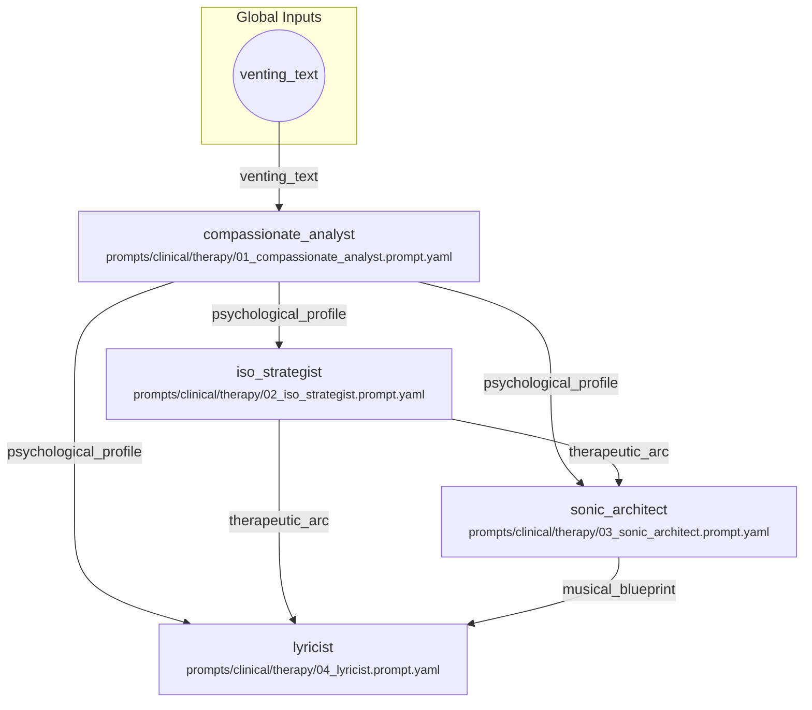

# Compassionate Music Therapy Workflow

A 4-step workflow to deconstruct venting, plan a therapeutic arc, compose a musical blueprint, and write lyrics.

## Visual Flow

```mermaid
flowchart TD
    subgraph Inputs [Global Inputs]
        inp_venting_text((venting_text))
    end
    compassionate_analyst["compassionate_analyst<br/><small>prompts/clinical/therapy/01_compassionate_analyst.prompt.yaml</small>"]
    iso_strategist["iso_strategist<br/><small>prompts/clinical/therapy/02_iso_strategist.prompt.yaml</small>"]
    sonic_architect["sonic_architect<br/><small>prompts/clinical/therapy/03_sonic_architect.prompt.yaml</small>"]
    lyricist["lyricist<br/><small>prompts/clinical/therapy/04_lyricist.prompt.yaml</small>"]
    inp_venting_text -->|venting_text| compassionate_analyst
    compassionate_analyst -->|psychological_profile| iso_strategist
    compassionate_analyst -->|psychological_profile| sonic_architect
    iso_strategist -->|therapeutic_arc| sonic_architect
    compassionate_analyst -->|psychological_profile| lyricist
    iso_strategist -->|therapeutic_arc| lyricist
    sonic_architect -->|musical_blueprint| lyricist
```
