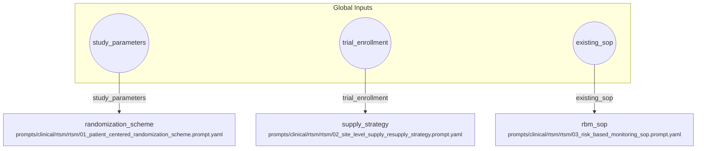

# RTSM Workflow

A workflow for designing a randomization scheme, a supply strategy, and a risk-based monitoring SOP.

## Visual Flow

```mermaid
flowchart TD
    subgraph Inputs [Global Inputs]
        inp_study_parameters((study_parameters))
        inp_trial_enrollment((trial_enrollment))
        inp_existing_sop((existing_sop))
    end
    randomization_scheme["randomization_scheme<br/><small>prompts/clinical/rtsm/rtsm/01_patient_centered_randomization_scheme.prompt.yaml</small>"]
    supply_strategy["supply_strategy<br/><small>prompts/clinical/rtsm/rtsm/02_site_level_supply_resupply_strategy.prompt.yaml</small>"]
    rbm_sop["rbm_sop<br/><small>prompts/clinical/rtsm/rtsm/03_risk_based_monitoring_sop.prompt.yaml</small>"]
    inp_study_parameters -->|study_parameters| randomization_scheme
    inp_trial_enrollment -->|trial_enrollment| supply_strategy
    inp_existing_sop -->|existing_sop| rbm_sop
```
