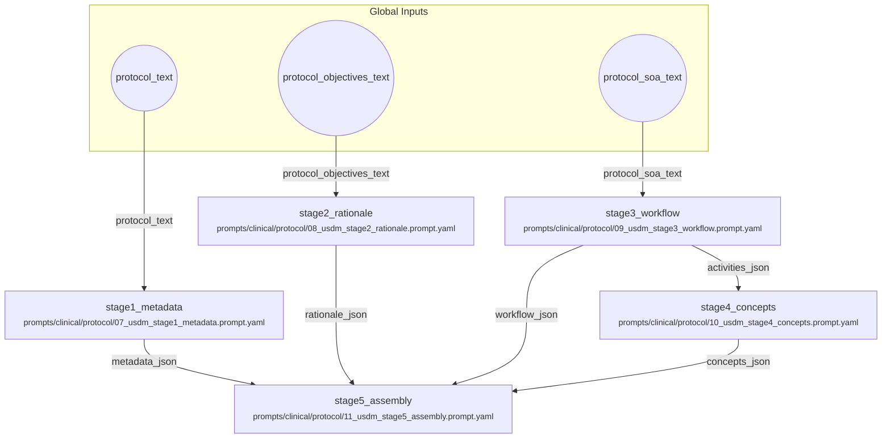

# Protocol to USDM Workflow

A 5-stage chain to convert unstructured Clinical Protocol text into CDISC USDM v3.0 JSON.

## Visual Flow

```mermaid
flowchart TD
    subgraph Inputs [Global Inputs]
        inp_protocol_text((protocol_text))
        inp_protocol_objectives_text((protocol_objectives_text))
        inp_protocol_soa_text((protocol_soa_text))
    end
    stage1_metadata["stage1_metadata<br/><small>prompts/clinical/protocol/07_usdm_stage1_metadata.prompt.yaml</small>"]
    stage2_rationale["stage2_rationale<br/><small>prompts/clinical/protocol/08_usdm_stage2_rationale.prompt.yaml</small>"]
    stage3_workflow["stage3_workflow<br/><small>prompts/clinical/protocol/09_usdm_stage3_workflow.prompt.yaml</small>"]
    stage4_concepts["stage4_concepts<br/><small>prompts/clinical/protocol/10_usdm_stage4_concepts.prompt.yaml</small>"]
    stage5_assembly["stage5_assembly<br/><small>prompts/clinical/protocol/11_usdm_stage5_assembly.prompt.yaml</small>"]
    inp_protocol_text -->|protocol_text| stage1_metadata
    inp_protocol_objectives_text -->|protocol_objectives_text| stage2_rationale
    inp_protocol_soa_text -->|protocol_soa_text| stage3_workflow
    stage3_workflow -->|activities_json| stage4_concepts
    stage1_metadata -->|metadata_json| stage5_assembly
    stage2_rationale -->|rationale_json| stage5_assembly
    stage3_workflow -->|workflow_json| stage5_assembly
    stage4_concepts -->|concepts_json| stage5_assembly
```
