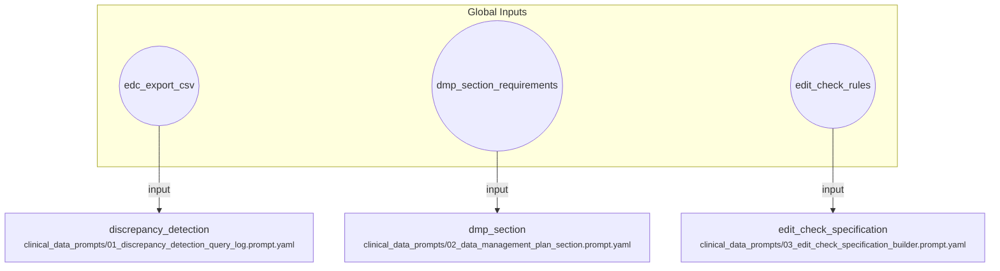

# Clinical Data Workflow

A workflow for detecting discrepancies, drafting a DMP section, and building edit check specifications.

## Visual Flow

```mermaid
flowchart TD
    subgraph Inputs [Global Inputs]
        inp_edc_export_csv((edc_export_csv))
        inp_dmp_section_requirements((dmp_section_requirements))
        inp_edit_check_rules((edit_check_rules))
    end
    discrepancy_detection["discrepancy_detection<br/><small>clinical_data_prompts/01_discrepancy_detection_query_log.prompt.yaml</small>"]
    dmp_section["dmp_section<br/><small>clinical_data_prompts/02_data_management_plan_section.prompt.yaml</small>"]
    edit_check_specification["edit_check_specification<br/><small>clinical_data_prompts/03_edit_check_specification_builder.prompt.yaml</small>"]
    inp_edc_export_csv -->|input| discrepancy_detection
    inp_dmp_section_requirements -->|input| dmp_section
    inp_edit_check_rules -->|input| edit_check_specification
```
