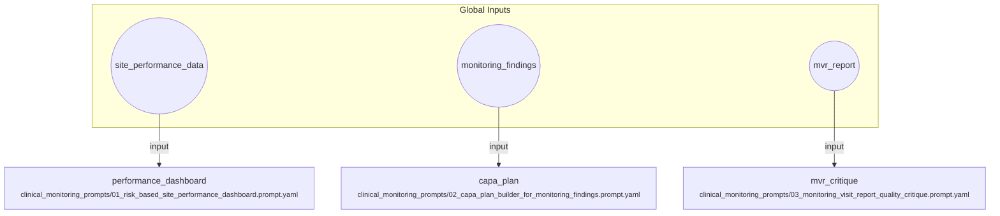

# Clinical Monitoring Workflow

A workflow for creating a site performance dashboard, building a CAPA plan, and critiquing a monitoring visit report.

## Visual Flow

```mermaid
flowchart TD
    subgraph Inputs [Global Inputs]
        inp_site_performance_data((site_performance_data))
        inp_monitoring_findings((monitoring_findings))
        inp_mvr_report((mvr_report))
    end
    performance_dashboard["performance_dashboard<br/><small>clinical_monitoring_prompts/01_risk_based_site_performance_dashboard.prompt.yaml</small>"]
    capa_plan["capa_plan<br/><small>clinical_monitoring_prompts/02_capa_plan_builder_for_monitoring_findings.prompt.yaml</small>"]
    mvr_critique["mvr_critique<br/><small>clinical_monitoring_prompts/03_monitoring_visit_report_quality_critique.prompt.yaml</small>"]
    inp_site_performance_data -->|input| performance_dashboard
    inp_monitoring_findings -->|input| capa_plan
    inp_mvr_report -->|input| mvr_critique
```
