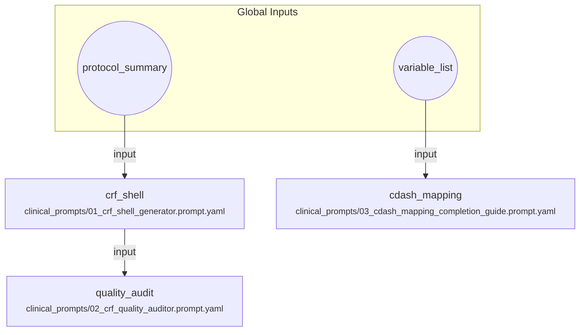

# Clinical Prompts Workflow

A workflow to generate a CRF shell, audit it, and create a CDASH mapping guide.

## Visual Flow

```mermaid
flowchart TD
    subgraph Inputs [Global Inputs]
        inp_protocol_summary((protocol_summary))
        inp_variable_list((variable_list))
    end
    crf_shell["crf_shell<br/><small>clinical_prompts/01_crf_shell_generator.prompt.yaml</small>"]
    quality_audit["quality_audit<br/><small>clinical_prompts/02_crf_quality_auditor.prompt.yaml</small>"]
    cdash_mapping["cdash_mapping<br/><small>clinical_prompts/03_cdash_mapping_completion_guide.prompt.yaml</small>"]
    inp_protocol_summary -->|input| crf_shell
    crf_shell -->|input| quality_audit
    inp_variable_list -->|input| cdash_mapping
```
