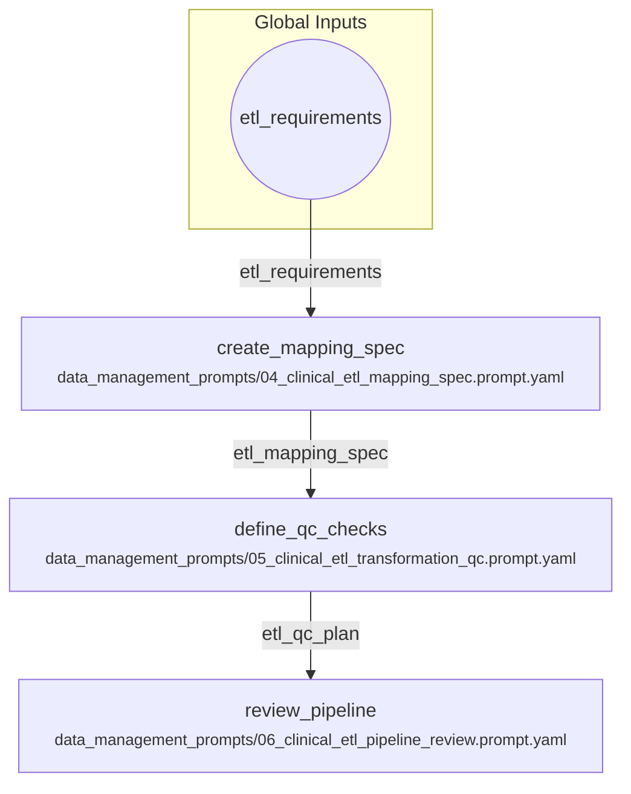

# Clinical ETL Pipeline Design and Review

A workflow to create an ETL mapping spec, define QC transformations, and review the final pipeline. This follows the sequence in the data_management_prompts directory (04, 05, 06).

## Visual Flow

