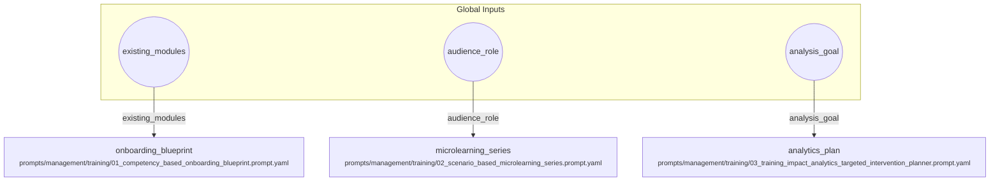

# Learning and Development Workflow

A workflow for creating a competency-based onboarding blueprint, a scenario-based microlearning series, and a training impact analytics plan.

## Visual Flow

```mermaid
flowchart TD
    subgraph Inputs [Global Inputs]
        inp_existing_modules((existing_modules))
        inp_audience_role((audience_role))
        inp_analysis_goal((analysis_goal))
    end
    onboarding_blueprint["onboarding_blueprint<br/><small>prompts/management/training/01_competency_based_onboarding_blueprint.prompt.yaml</small>"]
    microlearning_series["microlearning_series<br/><small>prompts/management/training/02_scenario_based_microlearning_series.prompt.yaml</small>"]
    analytics_plan["analytics_plan<br/><small>prompts/management/training/03_training_impact_analytics_targeted_intervention_planner.prompt.yaml</small>"]
    inp_existing_modules -->|existing_modules| onboarding_blueprint
    inp_audience_role -->|audience_role| microlearning_series
    inp_analysis_goal -->|analysis_goal| analytics_plan
```
